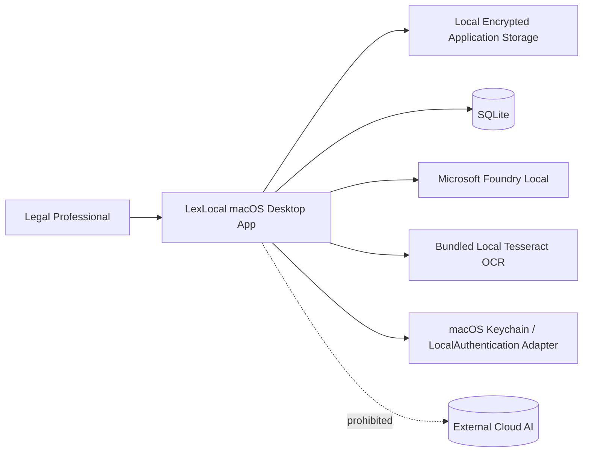
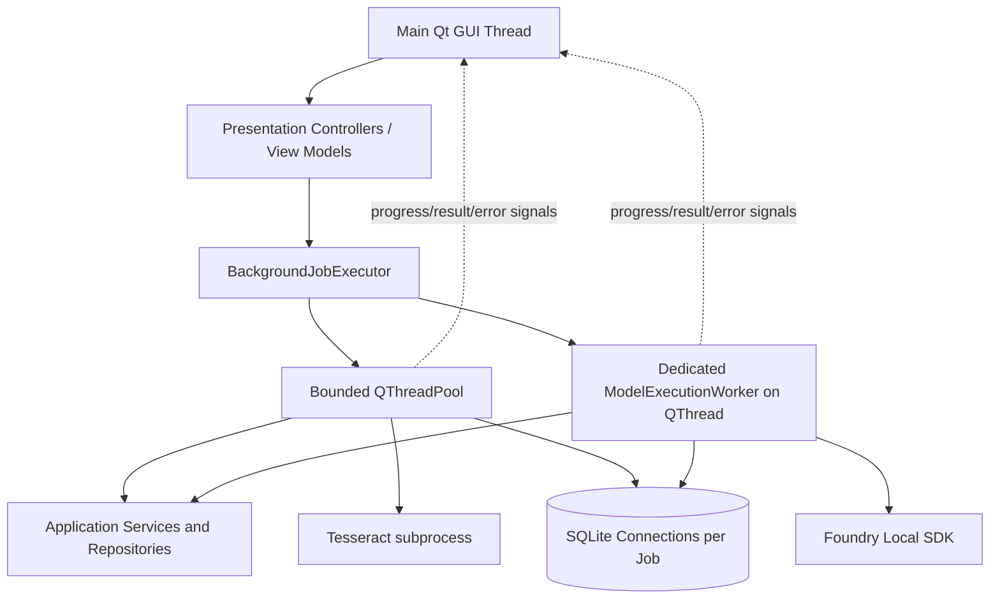
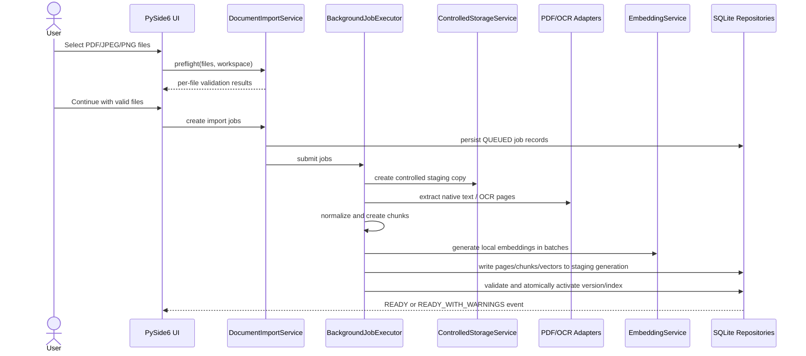
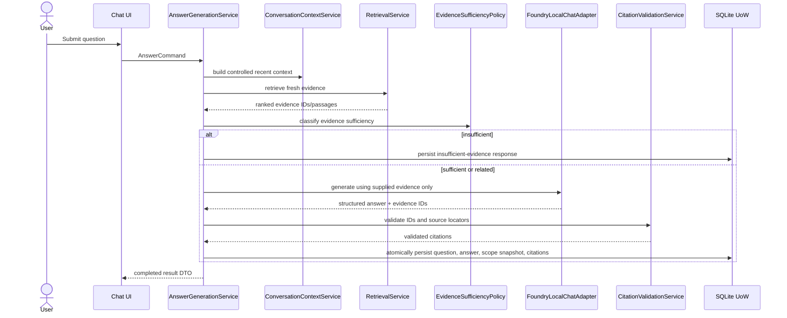
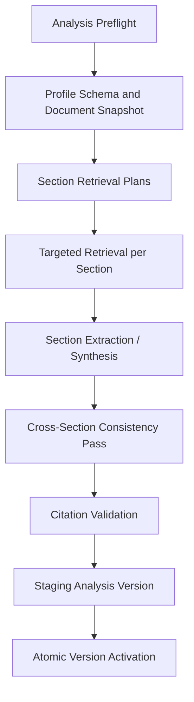
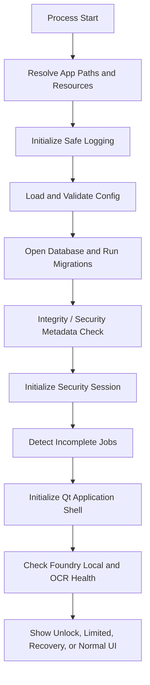

# LexLocal — System Architecture

**Document ID:** `04_SYSTEM_ARCHITECTURE.md`  
**Project:** LexLocal — On-Device Legal Document Intelligence Workspace  
**Status:** Approved implementation architecture baseline  
**Primary platform:** macOS on Apple Silicon  
**Future platform direction:** Windows-compatible core, without first-release Windows packaging  
**Initial user model:** Single user, single device  
**Architecture style:** Layered Python modular monolith with asynchronous local workers  
**Desktop UI:** PySide6 Qt Widgets  
**Core AI runtime:** Microsoft Foundry Local Python SDK  
**Persistence:** SQLite through Python's built-in `sqlite3` module  

---

## 1. Purpose and Authority

This document translates the approved product scope and user-flow decisions into a concrete, code-oriented system architecture.

It defines:

- the selected technology stack,
- process and thread boundaries,
- layer and dependency rules,
- module and service responsibilities,
- persistence and transaction strategy,
- local file-storage boundaries,
- document-processing and RAG pipelines,
- Foundry Local integration,
- OCR and PDF integration,
- background-job behavior,
- error and recovery architecture,
- packaging strategy,
- repository layout,
- implementation order,
- and the architectural acceptance checklist.

This document is subordinate to:

1. `02_SCOPE_AND_MVP.md` for product scope and mandatory first-release capabilities,
2. `03_USER_FLOWS_AND_STATES.md` for approved user-visible behavior and state transitions.

If this document conflicts with either approved document, the earlier approved scope or flow rule governs until the conflict is resolved explicitly.

Exact database tables belong to `05_DATA_MODEL.md`. Exact cryptographic algorithms, key derivation, key wrapping, Touch ID integration, and recovery-key implementation belong to `06_SECURITY_DESIGN.md`.

---

## 2. Architecture Decision Summary

The following decisions are locked for the first complete release.

| Area | Approved decision |
|---|---|
| Programming language | Python 3.11.x, with the exact patch version pinned for release |
| Desktop framework | PySide6 |
| UI technology | Qt Widgets; QML is not the primary UI technology |
| UI design | Reusable widgets, centralized design tokens, QSS styling, light/dark theme support |
| Architecture | Layered modular monolith |
| Local web server | None; no FastAPI, localhost REST API, or browser UI |
| Database | SQLite |
| Database API | Python built-in `sqlite3` |
| ORM | None |
| Migrations | Numbered forward-only SQL migration files and an application migration runner |
| Background execution | Bounded Qt worker threads with typed job signals |
| AI execution | Serialized local model execution through a dedicated model worker/coordinator |
| Foundry Local access | Direct Python SDK adapter; no mandatory local HTTP service |
| Embeddings | Foundry Local embedding API |
| Initial embedding model | Preferred requested alias `qwen3-embedding-0.6b`; catalog resolution is `TO_BE_VERIFIED` |
| Chat model | Initial candidate alias `qwen3-4b`; resolved identity/version are `TO_BE_VERIFIED` |
| Vector storage | `float32` vector payload in SQLite BLOB form, protected by the storage-encryption boundary |
| Retrieval | Python/NumPy cosine similarity and configurable top-K |
| Vector database | None in the first release |
| PDF extraction/rendering | Qt PDF through `QPdfDocument` and `QPdfView` |
| OCR | Local Tesseract 5 adapter with Turkish and English language data |
| Image preprocessing | Pillow-based conservative preprocessing; no advanced OCR guarantee |
| Configuration | Validated centralized configuration; no scattered magic numbers |
| Dependency injection | Explicit composition root; no external DI framework |
| Packaging | Standalone macOS `.app` using `pyside6-deploy`, wrapped in a controlled-demo `.dmg` |
| Public distribution | No App Store, Developer ID notarization, or commercial distribution promise in the first release |
| Cloud fallback | Prohibited |

### 2.1 Why this architecture was selected

The project core is Python-based local AI, OCR, document processing, SQLite persistence, cryptography, and retrieval. PySide6 avoids adding a React/TypeScript frontend, Rust or Node desktop shell, Python sidecar, IPC protocol, and second build system.

The architecture remains professional by separating presentation, application, domain, and infrastructure code rather than by adding unnecessary processes or technologies.

### 2.2 Microsoft project compatibility

The architecture keeps the mandatory baseline visible and directly testable:

- Foundry Local Python SDK,
- local embedding generation,
- chunk and vector persistence in SQLite,
- Python's built-in `sqlite3`,
- query embedding with the same model,
- cosine similarity in Python,
- top-K retrieval,
- retrieved-context prompting,
- local answer generation,
- citations,
- and insufficient-evidence behavior.

Professional LexLocal features extend this baseline but must not replace or hide it behind an unrelated vector database, cloud API, or opaque framework.

---

## 3. Architectural Drivers

### 3.1 Functional drivers

The architecture must support:

- multiple isolated workspaces,
- PDF/JPEG/PNG ingestion,
- native PDF extraction and page-level OCR fallback,
- page-aware chunks and source locators,
- local embeddings and retrieval,
- source-grounded Q&A,
- persistent chats,
- validated citations,
- structured legal analysis,
- document and analysis version history,
- archive/reactivate flows,
- secure deletion,
- activity history,
- first-run model setup,
- limited mode,
- and secure recovery mode.

### 3.2 Quality drivers

The architecture prioritizes:

1. **Completion:** it must be realistic for one developer and the available delivery period.
2. **Correctness:** no incomplete index, answer, or analysis is presented as final.
3. **Traceability:** answers and findings resolve to stable source evidence.
4. **Local privacy:** no intentional cloud transfer of legal content.
5. **Responsiveness:** document and AI operations never block the GUI event loop.
6. **Recoverability:** interrupted work is detected and safely restarted or removed.
7. **Testability:** core rules run without a graphical UI or real model where possible.
8. **Maintainability:** infrastructure libraries remain behind adapters.
9. **Professional delivery:** the application is packaged and demonstrated as a real desktop product.
10. **Future readiness:** Windows, folder watching, alternative OCR, and optimized vector search can be introduced without rewriting use cases.

### 3.3 Explicit non-goals

The architecture does not introduce:

- microservices,
- a local REST backend,
- Electron or Tauri,
- a distributed event bus,
- Redis/Celery,
- a specialized vector database,
- automatic cloud fallback,
- multi-user tenancy,
- or enterprise infrastructure.

These would increase delivery risk without improving the required local single-user workflow.

---

## 4. System Context



LexLocal is one local desktop application. Foundry Local and OCR are local runtime dependencies. The application does not require a remote application server.

---

## 5. Architecture Style and Dependency Rules

LexLocal uses a **layered modular monolith**.

```text
Presentation
    -> Application
        -> Domain

Infrastructure
    -> implements ports owned by Application/Domain

Bootstrap / Composition Root
    -> constructs and connects all implementations
```

### 5.1 Presentation layer

Responsibilities:

- Qt windows, dialogs, widgets, and models,
- navigation,
- view state,
- rendering progress and errors,
- translating user actions into application commands,
- and displaying result DTOs.

The presentation layer must not:

- execute SQL,
- read or write controlled files directly,
- call Tesseract directly,
- construct Foundry prompts,
- invoke Foundry Local directly,
- apply domain state transitions,
- or perform cryptographic operations.

### 5.2 Application layer

Responsibilities:

- use-case orchestration,
- state and capability guards,
- transaction boundaries,
- job creation,
- repository coordination,
- prompt workflow coordination,
- result DTO construction,
- and activity-event creation.

Application services depend on interfaces, not concrete Qt, SQLite, Foundry, or OCR implementations.

### 5.3 Domain layer

Responsibilities:

- entities and value objects,
- stable identifiers,
- state enums,
- allowed transitions,
- evidence-sufficiency rules,
- active-version invariants,
- analysis version invariants,
- and domain-specific validation.

The domain layer must not import:

- PySide6,
- `sqlite3`,
- Foundry Local SDK,
- OCR libraries,
- filesystem libraries for persistence,
- or platform-specific security APIs.

### 5.4 Infrastructure layer

Responsibilities:

- SQLite repositories,
- migration execution,
- encrypted file storage,
- PDF and image adapters,
- OCR,
- Foundry Local adapters,
- model lifecycle,
- macOS security integration,
- logging,
- diagnostics,
- and packaging-resource resolution.

### 5.5 Bootstrap layer

A single composition root creates concrete implementations and passes them into application services.

There is no service-locator pattern and no global mutable dependency container.

---

## 6. Runtime and Thread Topology



### 6.1 Main GUI thread

Only the main Qt thread may create or mutate visible UI objects.

The GUI thread performs:

- event handling,
- navigation,
- lightweight DTO validation,
- rendering,
- and job submission.

It must not perform:

- file hashing for large files,
- PDF extraction,
- OCR,
- chunking,
- embedding,
- vector search,
- Foundry inference,
- long database operations,
- or bulk encryption/decryption.

### 6.2 General background job pool

Independent document and maintenance operations use a bounded `QThreadPool` with `QRunnable`-backed jobs.

Initial limits:

- maximum two document-processing jobs concurrently,
- maximum one disk-heavy cleanup/deletion job,
- configurable lower limits when resource checks require it.

Each job has:

- stable job ID,
- job type,
- workspace ID where applicable,
- cancellation token,
- current stage,
- retry metadata,
- progress signals,
- result signal,
- sanitized failure signal,
- and its own SQLite connection/unit of work.

### 6.3 Dedicated model execution worker

Foundry Local model lifecycle and inference are serialized through a long-lived `ModelExecutionWorker` hosted on a dedicated `QThread`.

Reasons:

- one owner controls model download/load/unload state,
- concurrent large-model requests are avoided,
- Q&A and analysis requests receive predictable ordering,
- model health transitions are centralized,
- and the GUI remains responsive.

Only one heavy model action is active at a time in the first release.

Embedding batches and chat inference may share the coordinator but use separate model handles. The coordinator may keep a loaded model warm during an active session and unload it after a configurable idle period or memory-pressure signal.

### 6.4 Cancellation semantics

Cancellation is cooperative.

- Pipeline stages check the cancellation token between pages, batches, and persistence steps.
- A Tesseract subprocess may be terminated safely when requested.
- If a Foundry SDK call cannot be interrupted, LexLocal marks the request cancelled, ignores the late result, and does not persist it.
- Cancellation never activates staging data.

### 6.5 Why processes are not used initially

Separate Python worker processes would require IPC, serialization, process supervision, and additional packaging. They remain a future option behind the `JobExecutor` interface if measurement proves that a specific workload needs crash or memory isolation.

---

## 7. Desktop Presentation Architecture

### 7.1 Qt Widgets

The first release uses Qt Widgets, including:

- `QMainWindow` for the application shell,
- `QStackedWidget` for primary navigation,
- `QSplitter` for chat/analysis and source-viewer layouts,
- `QTableView`/`QListView` with custom models for documents and workspaces,
- `QTabWidget` for document details,
- `QDialog` for preflight and confirmations,
- `QPdfView` for PDF viewing,
- and reusable custom widgets for cards, status badges, progress rows, errors, and empty states.

QML is not required for the first release. An isolated `QQuickWidget` may be considered later only for a genuinely animation-heavy component.

### 7.2 Presentation pattern

Views remain thin. Each major screen has a controller or view-model-like presentation object that:

- exposes immutable display state,
- submits commands to application services,
- listens to job signals,
- maps typed errors to localized messages,
- and refreshes models after successful operations.

Presentation state and persisted domain state must not be conflated.

### 7.3 Design system

The UI uses:

- centralized spacing tokens,
- typography tokens,
- semantic status colors,
- shared icon rules,
- reusable buttons and form controls,
- consistent focus and keyboard navigation,
- light/dark theme palettes,
- and QSS loaded from application resources.

The default unstyled Qt appearance is not treated as the product design.

### 7.4 UI-state source of truth

Persisted state is read from repositories. Temporary UI state, such as expanded panels or selected tabs, remains in presentation state unless it must survive restart.

No UI widget is the authoritative owner of a document, chat, analysis, or processing state.

---

## 8. Application Modules and Service Boundaries

### 8.1 Setup, security, and capability modules

- `SetupService`
- `SecuritySessionService`
- `RecoveryService`
- `ModelManagerService`
- `CapabilityService`
- `StorageCapacityService`
- `RecoveryModeService`

### 8.2 Workspace module

- `WorkspaceService`
- `WorkspaceArchiveService`
- `WorkspaceDeletionService`
- `WorkspaceRepository`
- `WorkspaceKeyRepository`

### 8.3 Document module

- `DocumentPreflightService`
- `DocumentImportService`
- `DocumentValidationService`
- `ControlledStorageService`
- `DocumentProcessingService`
- `DocumentVersionService`
- `DocumentDeletionService`
- `ProcessingRecoveryService`
- `DocumentRepository`
- `ProcessingJobRepository`

### 8.4 Extraction and OCR module

- `PdfDocumentAdapter`
- `NativeTextExtractor`
- `ImageLoader`
- `ImagePreprocessor`
- `OcrEngine`
- `TextNormalizationService`
- `PageCoverageService`

### 8.5 Retrieval module

- `ChunkingService`
- `EmbeddingService`
- `IndexingService`
- `EmbeddingRepository`
- `ChunkRepository`
- `IndexGenerationRepository`
- `RetrievalService`
- `EvidenceSufficiencyPolicy`

### 8.6 Chat and answer module

- `ChatService`
- `ChatScopeService`
- `ConversationContextService`
- `ChatTitleService`
- `PromptBuilder`
- `AnswerGenerationService`
- `CitationValidationService`
- `SourceResolutionService`

### 8.7 Structured analysis module

- `AnalysisPreflightService`
- `AnalysisGenerationService`
- `AnalysisSectionService`
- `AnalysisDraftService`
- `AnalysisVersionService`
- `AnalysisStalenessService`
- `AnalysisDiffService`

### 8.8 Cross-cutting modules

- `BackgroundJobService`
- `ActivityHistoryService`
- `DiagnosticService`
- `Clock`
- `IdGenerator`
- `TransactionManager`
- `ConfigurationService`

Exact class names may change, but the responsibilities and dependency boundaries must remain visible.

---

## 9. Persistence Architecture

### 9.1 SQLite and `sqlite3`

The application uses Python's built-in `sqlite3` module to match the Microsoft brief directly.

Raw SQL exists only in:

- repository implementations,
- query objects,
- and migration files.

UI, domain entities, and Foundry orchestration code never execute SQL.

### 9.2 Connection factory

A `DatabaseConnectionFactory` creates configured connections.

Every connection must apply at least:

```sql
PRAGMA foreign_keys = ON;
PRAGMA journal_mode = WAL;
PRAGMA busy_timeout = 5000;
```

Additional durability settings are selected conservatively and documented in the security/data documents.

Connections are not shared across worker threads. Each use case or background job opens and closes its own connection through a unit-of-work context.

### 9.3 Unit of work

A lightweight custom unit of work provides:

- one connection,
- explicit begin/commit/rollback,
- repository instances sharing that connection,
- and post-commit event dispatch.

Example:

```python
class SqliteUnitOfWork:
    def __enter__(self) -> "SqliteUnitOfWork": ...
    def commit(self) -> None: ...
    def rollback(self) -> None: ...
    def __exit__(self, exc_type, exc, tb) -> None: ...
```

Critical state changes use explicit transactions. `BEGIN IMMEDIATE` may be used for short activation/deletion transactions that must prevent a competing writer from changing the same active pointer.

### 9.4 Repositories

Repositories are organized around aggregates and use cases, not one generic CRUD repository.

Required repository groups include:

- workspace,
- document/document version/page,
- processing job,
- chunk/embedding/index generation,
- chat/message/citation,
- analysis/draft/version/section,
- activity event,
- security metadata.

### 9.5 Migrations

Schema changes use numbered forward-only SQL files:

```text
migrations/
├── 001_initial.sql
├── 002_document_versions.sql
├── 003_chat_and_citations.sql
└── 004_analysis_versions.sql
```

The migration runner:

1. opens the database before normal repositories,
2. verifies applied migration checksums,
3. applies pending migrations in order inside transactions where SQLite permits,
4. records version, name, checksum, and timestamp,
5. refuses normal startup when migration integrity is inconsistent.

The first release does not implement automated downgrade migrations.

### 9.6 Sensitive payload boundary

The built-in SQLite engine remains the required database path. Sensitive fields are protected before they reach `sqlite3` through an `EncryptedPayloadCodec`/repository boundary.

Examples of protected payloads:

- extracted page text,
- OCR text,
- chunk text,
- embeddings,
- questions and answers,
- analysis content,
- supporting passages.

The exact cryptographic design is defined in `06_SECURITY_DESIGN.md`.

---

## 10. Local Storage Architecture

### 10.1 macOS application data root

The initial layout is under the user's Application Support directory:

```text
~/Library/Application Support/LexLocal/
├── config/
├── database/
│   └── lexlocal.db
├── workspaces/
│   └── <workspace-id>/
│       ├── sources/
│       ├── staging/
│       └── derived/
├── temp/
├── logs/
└── resources-manifest/
```

Foundry Local's own model cache remains managed by Foundry Local. LexLocal stores only model identity, compatibility, and health metadata.

### 10.2 Stable identifiers and relative paths

Persistent references use UUID-style stable IDs. Database paths are relative to the LexLocal data root or workspace root.

Display names and original user paths are not used as primary identity.

### 10.3 Controlled source copies

Imported documents are copied into workspace-controlled storage. The system does not depend on the original Finder path remaining available.

The storage service performs:

1. write to a new staging path,
2. encryption/protection,
3. flush and integrity validation,
4. atomic rename into the final controlled path,
5. database commit linking the path to the version.

### 10.4 Atomic writes and cleanup

File updates use write-new-then-rename behavior. Existing valid files are not overwritten in place.

Every staging directory is associated with a job ID. Startup recovery can identify and remove abandoned staging data after user confirmation or a safe recovery decision.

### 10.5 Source viewing

Where possible, the source viewer decrypts source bytes into memory and loads PDF data through a Qt `QIODevice`-compatible buffer. If a third-party component requires a path, the security design may permit a controlled short-lived decrypted temporary file with strict cleanup.

---

## 11. Document Ingestion and Processing Pipeline



### 11.1 Stages

The internal pipeline is:

```text
Preflight validation
-> SHA-256 hash and duplicate check
-> controlled encrypted source copy
-> candidate document-version record
-> page inventory
-> native PDF extraction or OCR decision per page
-> text normalization
-> page-aware chunking
-> batch embedding
-> staging persistence
-> source-locator and citation-integrity validation
-> atomic index/version activation
-> READY or READY_WITH_WARNINGS
```

### 11.2 Independent document jobs

Each accepted file becomes an independent job. A failure in one file does not roll back already successful files from the same selection batch.

### 11.3 Staging and activation

Derived records are written under an inactive `index_generation_id` and candidate document-version state.

Only after mandatory validation succeeds does a short transaction:

- mark the candidate version active,
- mark the previous version archived when replacing,
- activate the new index generation,
- and publish the completion activity event.

Retrieval filters only active generations and eligible versions.

### 11.4 Retry and idempotency

A retry creates or reuses a controlled attempt record but cannot create duplicate active chunks or vectors.

Idempotency is based on:

- workspace ID,
- document/document-version ID,
- content hash,
- processing profile version,
- embedding model identity,
- and index generation.

### 11.5 Partial page success

Page records carry extraction status. When some pages fail:

- successful pages continue through chunking and embedding,
- failed pages have no eligible chunks,
- coverage information is persisted,
- the final version becomes `READY_WITH_WARNINGS`,
- citations cannot resolve to failed pages.

---

## 12. PDF, Image, and OCR Architecture

### 12.1 Qt PDF adapter

`QtPdfDocumentAdapter` wraps `QPdfDocument` for:

- file validation,
- protected/unsupported PDF detection,
- page count,
- page text extraction,
- text bounds where available,
- page rendering to `QImage`,
- and source-view navigation.

`QPdfView` provides the user-facing PDF viewer.

Qt objects used in background extraction are created and used within their owning worker thread. UI viewer instances remain on the GUI thread.

### 12.2 Page-level extraction decision

For each PDF page:

1. extract native text,
2. normalize it for quality assessment,
3. calculate a simple usability score using text length, printable-character ratio, and word/line indicators,
4. accept native text when usable,
5. otherwise render the page and run OCR.

The threshold is configurable and tested; it is not presented as a universal quality guarantee.

### 12.3 OCR adapter

`TesseractOcrAdapter` is the first implementation of `OcrEngine`.

It uses:

- Tesseract 5,
- Turkish (`tur`) and English (`eng`) trained data,
- a bundled/controlled executable path for the packaged app,
- and structured OCR output containing text, confidence indicators, and word/line bounding boxes where available.

The normal user interface says “Görüntüden metin çıkarılacak”; technical details may identify Tesseract in diagnostics and documentation.

### 12.4 Image preprocessing

`PillowImagePreprocessor` performs conservative operations when useful:

- orientation normalization,
- grayscale conversion,
- contrast adjustment,
- sensible rescaling,
- and optional thresholding.

Advanced deskewing, layout reconstruction, handwriting recognition, and table reconstruction are not guaranteed in the first release.

### 12.5 OCR packaging

The controlled-demo `.app`/`.dmg` bundles:

- the Tesseract executable and required native libraries where licensing permits,
- `tur.traineddata`,
- `eng.traineddata`,
- and a resource manifest with expected versions/checksums.

Application startup validates the OCR resource path before enabling OCR-dependent processing.

---

## 13. Chunking Architecture

### 13.1 Chunk boundaries

The initial chunker is page-aware and paragraph/heading-aware.

First-release rule:

- a chunk belongs to one page,
- a source locator is therefore always unambiguous,
- long pages may produce multiple chunks,
- short adjacent paragraphs on the same page may be combined,
- overlap is limited and remains on the same page.

This trades some cross-page continuity for stronger citation reliability and simpler implementation.

### 13.2 Initial configuration

Initial evaluation defaults, subject to tuning:

- target size: approximately 500–700 tokens,
- maximum size: approximately 900 tokens,
- overlap: approximately 80 tokens,
- minimum useful chunk length: configurable,
- heading text copied into child chunks where available.

If an exact model tokenizer is unavailable in the integration path, the initial implementation uses a documented deterministic approximation rather than pretending the value is exact.

### 13.3 Chunk metadata

Every chunk carries:

- chunk ID,
- workspace ID,
- document ID,
- exact document-version ID,
- page ID/page number,
- source locator ID,
- order within page/document,
- extraction method,
- normalized text hash,
- processing profile version,
- and embedding/index metadata.

---

## 14. Embedding and Vector Index Architecture

### 14.1 Foundry Local embedding provider

`FoundryLocalEmbeddingProvider` implements `EmbeddingProvider`.

The preferred requested first-release alias, pending catalog verification, is:

```text
qwen3-embedding-0.6b
```

The setup process resolves the alias through the local catalog and persists:

- requested alias,
- resolved model ID,
- model version,
- embedding dimensions,
- runtime/provider details where available,
- and index creation timestamp.

LexLocal does not silently substitute an incompatible embedding model. A model change requires a new index generation/re-index.

### 14.2 Batch generation

Chunks are embedded in configurable batches. The service reports progress per completed batch and checks cancellation between batches.

The same provider and exact compatible model identity are used for query embeddings.

### 14.3 Vector representation

The baseline vector representation is:

- NumPy `float32`,
- normalized to unit length after validation,
- serialized to a deterministic BLOB byte order,
- with dimensions and dtype stored as metadata,
- and protected by the sensitive-payload storage boundary.

Vectors with incorrect dimensions, non-finite values, or zero norm are rejected before index activation.

### 14.4 Retrieval implementation

The required retrieval path is explicit:

1. resolve active workspace and chat/document scope,
2. embed the query using the compatible model,
3. load eligible vectors from SQLite,
4. decode them into a NumPy matrix,
5. compute cosine similarity,
6. rank candidates,
7. return configurable top-K evidence.

Because stored vectors and query vectors are normalized, the implementation may use a dot product as the cosine-similarity calculation while retaining clear tests and naming.

### 14.5 In-memory cache

A small per-workspace cache may store the active vector matrix and row-to-evidence mapping.

The cache key includes:

- workspace ID,
- active index generation IDs,
- selected document-version scope,
- embedding model identity.

The cache is invalidated on version activation, deletion, re-index, workspace lock policy, or model change.

The SQLite brute-force path remains the authoritative baseline and must work without the cache.

### 14.6 No vector database

FAISS, Qdrant, Chroma, pgvector, and SQLite vector extensions are not required for the first release. A future `VectorSearchProvider` may replace the brute-force implementation without changing Q&A use cases.

---

## 15. Foundry Local Integration

### 15.1 SDK boundary

All Foundry Local use is contained in `infrastructure/foundry/` behind:

- `ModelCatalogPort`,
- `ModelLifecyclePort`,
- `EmbeddingProvider`,
- `ChatInferenceProvider`.

Application and domain code do not import Foundry Local SDK classes.

### 15.2 Initialization

At startup or model repair:

1. construct SDK configuration with the LexLocal application name,
2. initialize the Foundry Local manager,
3. resolve configured model aliases,
4. check cache/download state,
5. validate model compatibility,
6. perform a minimal local inference/embedding health test,
7. publish model capability state.

### 15.3 Model manifest

A release model manifest contains:

- requested/candidate alias,
- resolved catalog model ID,
- model version,
- Foundry Local SDK/runtime/provider versions,
- verified hardware and `verified_at` timestamp,
- compatibility result,
- minimum free disk estimate,
- supported task type,
- prompt/template version,
- and known hardware profile notes.

The architecture does not hard-code catalog model IDs throughout the codebase.

### 15.4 Chat model selection

The initial requested candidate alias is `qwen3-4b`. It is not a verified
catalog guarantee or final release identity. Catalog resolution and suitability
remain `TO_BE_VERIFIED` on the release environment.

Before the final demo, the exact resolved model/version must be pinned after a small controlled comparison against at least one alternative such as `phi-4-mini` using:

- Turkish legal-document comprehension,
- instruction following,
- structured output reliability,
- citation-ID discipline,
- latency,
- and memory behavior.

Changing this release configuration does not alter the architecture.

Model verification:

1. record Foundry Local SDK and runtime versions,
2. resolve the requested alias through the local catalog,
3. record resolved model ID and version,
4. run dimension and finite-vector checks for embeddings,
5. run local chat inference,
6. test Turkish legal structured output and evidence-ID discipline,
7. restart offline and verify cached use,
8. measure latency and peak memory,
9. persist results in the release manifest and test evidence,
10. fail setup/compatibility explicitly if verification fails; never silently
    substitute another model.

### 15.5 Prompt and output contracts

Prompts are versioned resources, not inline strings scattered across services.

Model outputs use constrained structured contracts for:

- answer text,
- evidence state,
- cited evidence IDs,
- analysis sections,
- suggested profile/type,
- and optional change summaries.

Responses are parsed and validated. Invalid output may receive one constrained repair attempt. No invalid citation or malformed completed analysis is persisted as successful.

### 15.6 No cloud and no hidden fallback

If the runtime or configured model is unavailable:

- model-dependent capabilities enter Limited Mode,
- the user receives local repair actions,
- no remote endpoint is called,
- no alternate cloud model is selected.

### 15.7 Streaming policy

Although the SDK may support streaming, the approved UX does not display unvalidated partial answer text. LexLocal uses non-streamed final presentation or buffers internal streaming until output and citations are validated.

---

## 16. Q&A RAG Orchestration



### 16.1 Required sequence

```text
Validate active workspace and chat
-> resolve chat document scope snapshot
-> build controlled conversational context
-> generate query embedding
-> retrieve only active eligible versions
-> evaluate evidence sufficiency
-> construct evidence-ID-based prompt
-> run local inference when permitted
-> parse structured output
-> validate all citation evidence IDs
-> commit completed question/answer/citations atomically
```

### 16.2 Conversation context

The context builder uses:

- the current question,
- recent turns,
- and a locally generated short chat summary when needed.

Previous AI answers help resolve conversational references but are never inserted as legal evidence. Fresh retrieval runs for every new question.

### 16.3 Evidence sufficiency

`EvidenceSufficiencyPolicy` is deterministic and configurable. It receives retrieval metrics and coverage data; it does not treat similarity as model confidence.

It returns:

- `SUFFICIENT`,
- `RELATED_BUT_INSUFFICIENT`,
- or `INSUFFICIENT`.

The model may not override this policy to invent a definitive answer.

### 16.4 Citation safety

The model sees stable evidence IDs such as `E1`, `E2`, not free-form instructions to invent file names and pages.

The citation validator accepts only IDs from the exact retrieval set used for that generation. It resolves them to persisted source-locator records and rejects:

- unknown IDs,
- inactive or mismatched evidence,
- fabricated pages,
- and source references outside the answer's scope snapshot.

### 16.5 Atomic answer commit

A completed answer, scope snapshot, exact document-version IDs, evidence references, and citations are committed together.

A model or citation failure leaves the user's question available in UI state for retry but does not create a completed assistant message.

---

## 17. Structured Analysis Orchestration



### 17.1 Generation strategy

A structured analysis is not generated from one generic top-K request.

For each profile:

- every section has a versioned retrieval plan,
- targeted queries retrieve relevant evidence,
- section outputs use structured schemas,
- broad synthesis sections may consume validated summaries and evidence from multiple sections,
- concrete findings retain finding-level evidence IDs.

### 17.2 Staging and commit

New analysis output is written to a staging version. The current valid analysis remains available until:

- required sections are complete,
- structured output is valid,
- citations validate,
- and the final version transaction commits.

Failure does not replace the previous valid version.

### 17.3 Section regeneration

Section regeneration:

1. snapshots the current analysis version,
2. copies unchanged sections into a new candidate version,
3. retrieves fresh evidence for selected sections,
4. generates and validates replacements,
5. commits a new immutable version.

User-edited content is never silently overwritten.

### 17.4 Drafts and versions

Auto-saved edits are stored as mutable draft records separate from immutable analysis versions.

Explicit save:

- validates the draft,
- creates a new analysis version,
- records changed sections and user-origin metadata,
- removes or advances the draft pointer.

### 17.5 Staleness

An analysis version stores the exact document-version/profile snapshot used to generate it.

`AnalysisStalenessService` compares that snapshot with the current workspace state and records reasons without mutating historical content.

### 17.6 Deterministic diff

Text and citation differences are calculated deterministically by section. A local AI summary may explain the change but is not the source of truth for the diff.

Restore is also deterministic and does not use the model worker or retrieval
orchestration. `RestoreAnalysisVersionService` copies the selected immutable
version's sections, citation relationships, and source snapshot into the next
version number. It records the previously current version as
`based_on_version_id`, the copied historical version as
`restored_from_version_id`, sets `creation_reason` and `content_source` to
`RESTORE`, leaves `generation_run_id` null, and appends a safe activity event.
No `analysis_generation_runs` row is created.

---

## 18. Citation and Source Viewer Architecture

### 18.1 Source-locator model

A citation resolves through immutable IDs:

```text
Citation
-> EvidenceReference
-> Chunk/PageContent
-> SourceLocator
-> exact DocumentVersion
-> controlled source blob
```

It never resolves through the current active filename alone.

### 18.2 Split viewer

The UI uses a resizable `QSplitter`:

- left: chat or analysis content,
- right: PDF/image source viewer and supporting passage.

### 18.3 PDF navigation

For PDF sources:

- decrypt/open the exact version,
- set it on `QPdfView`,
- navigate to the stored page,
- highlight geometric bounds when reliable,
- display the validated supporting passage separately.

When exact text geometry is unavailable, the system opens the validated page and shows the passage without inventing coordinates.

### 18.4 Image sources

For JPEG/PNG sources, the viewer shows the original controlled image and a separate OCR passage/bounding-box overlay when available.

### 18.5 Historical sources

Old citations open the exact archived version used by the answer or analysis and show an archived-version warning. New retrieval never uses that archived version.

If a source was permanently deleted, the citation remains a historical record but reports that the source is no longer viewable; it does not redirect.

---

## 19. State, Events, and UI Updates

### 19.1 Persisted state machines

The persisted states defined in `03_USER_FLOWS_AND_STATES.md` remain authoritative for:

- session,
- model,
- workspace,
- document preflight,
- processing job,
- document version,
- chat request,
- evidence result,
- analysis,
- and recovery mode.

### 19.2 Domain events

Application operations may return domain events such as:

- `WorkspaceCreated`,
- `DocumentProcessingStarted`,
- `DocumentVersionActivated`,
- `AnswerCommitted`,
- `AnalysisVersionCreated`,
- `WorkspaceArchived`.

These are plain in-process objects. There is no distributed event broker.

### 19.3 Activity history

`ActivityHistoryService` converts approved significant events into safe user-visible activity entries, preferably within the same transaction as the state change.

### 19.4 Technical UI signals

Background executors emit Qt signals for:

- queued,
- stage changed,
- measurable progress,
- completed,
- cancelled,
- failed.

Signals carry DTOs and IDs, not live repository connections or domain entities.

---

## 20. Transactions, Rollback, and Consistency

### 20.1 General rule

An operation must never expose a database record as active before its required file and derived data are valid.

### 20.2 Filesystem/database coordination

SQLite cannot atomically commit filesystem writes. LexLocal uses a staged saga-like sequence:

1. create durable staging files,
2. write candidate database records,
3. validate candidate content,
4. atomically move/rename final files,
5. commit active database pointers,
6. clean obsolete staging artifacts.

If a later step fails, compensation removes candidate data or leaves it marked non-active for startup recovery.

### 20.3 Critical transaction boundaries

Explicit transaction plans are required for:

- workspace creation,
- job creation,
- index activation,
- document-version replacement,
- answer commit,
- analysis-version commit,
- archive/reactivate,
- document deletion,
- workspace deletion,
- password/recovery key metadata rotation.

### 20.4 Deletion

Deletion first creates a deterministic deletion plan identifying database rows, controlled files, derived data, and key material.

Workspace deletion moves to a blocked `DELETING` state before destructive steps. If deletion fails, the workspace remains inaccessible in `DELETION_RECOVERY` until retry or recovery completes.

Physical SSD overwrite is not claimed.

---

## 21. Error Architecture and Capability Modes

### 21.1 Typed errors

Infrastructure exceptions are translated into typed application errors with:

- stable error code,
- category,
- user-message key,
- retryable flag,
- operation/job ID,
- safe diagnostic context,
- and original exception retained only in protected diagnostics.

Categories:

- validation,
- storage capacity,
- document parsing,
- OCR,
- embedding,
- retrieval,
- model unavailable,
- model output validation,
- citation validation,
- cancellation,
- database integrity,
- key/decryption,
- migration,
- unexpected internal error.

### 21.2 Limited Mode

Limited Mode is capability-based, not a separate database.

When the required local model is unavailable:

- existing workspaces and historical outputs remain viewable,
- model-dependent and new document-processing actions are disabled,
- model repair is enabled,
- no cloud fallback occurs.

### 21.3 Recovery Mode

If encrypted data, database integrity, or migration integrity cannot be trusted:

- normal repositories are not exposed to the normal UI,
- the application starts a restricted recovery composition root,
- destructive reset is never automatic,
- safe diagnostics and supported recovery actions are offered.

### 21.4 Retry policy

Retries are explicit and bounded.

- deterministic validation errors are not retried automatically,
- transient SQLite lock errors may use a short bounded retry through `busy_timeout`,
- model health is checked before model retry,
- malformed model output receives at most one repair attempt,
- repeated failures surface to the user.

---

## 22. Startup and Shutdown Architecture

### 22.1 Startup sequence



The normal workspace UI is not shown until migrations, database access, and security-state checks have completed safely.

### 22.2 Shutdown sequence

On normal shutdown:

1. stop accepting new jobs,
2. request cooperative cancellation or safe completion according to job type,
3. mark unfinished jobs recoverable/incomplete,
4. close model handles,
5. close worker-owned database connections,
6. clean safe temporary artifacts,
7. clear in-memory session/decryption material where practical,
8. flush diagnostics,
9. exit the Qt event loop.

The application does not claim that Python can guarantee complete memory zeroization; the security design defines practical controls.

---

## 23. Configuration Architecture

### 23.1 Configuration sources

Configuration is layered:

1. packaged defaults,
2. release model manifest,
3. local non-sensitive application config,
4. user preferences,
5. development-only environment overrides.

Sensitive keys and passwords are never stored in ordinary config files.

### 23.2 Required configurable values

- chat model alias/identity,
- embedding model alias/identity,
- chunk target/max/overlap,
- top-K,
- evidence thresholds,
- maximum context size,
- embedding batch size,
- inference timeout,
- model idle-unload time,
- document concurrency,
- OCR languages,
- native-text usability threshold,
- inactivity lock duration,
- disk-space safety margin,
- diagnostic log level,
- temporary-data policy.

### 23.3 Validation

Configuration is parsed into typed immutable settings objects at startup. Invalid values block the affected capability rather than propagating as unexplained runtime failures.

---

## 24. Logging, Diagnostics, and Observability

### 24.1 Separate channels

LexLocal keeps two different records:

1. **Activity history:** user-facing business events.
2. **Technical diagnostics:** developer/support-oriented operational records.

### 24.2 Structured diagnostic fields

Diagnostics may record:

- timestamp,
- severity,
- component,
- operation/job ID,
- workspace/document IDs,
- state transition,
- duration,
- model identity,
- page/chunk counts,
- safe error code.

### 24.3 Prohibited diagnostic content

Normal logs must not contain:

- document text,
- OCR text,
- chunk text,
- full user questions or answers,
- analysis content,
- prompt bodies,
- passwords,
- recovery keys,
- encryption keys,
- decrypted source bytes.

### 24.4 Performance instrumentation

Application services expose timing spans for:

- validation,
- extraction/OCR,
- chunking,
- embedding,
- SQLite persistence,
- retrieval,
- inference,
- citation validation,
- analysis sections.

These measurements feed the later benchmark report without mandatory telemetry.

---

## 25. Security Architecture Boundary

This architecture establishes security integration points without pre-empting `06_SECURITY_DESIGN.md`.

Required ports:

- `PasswordKdfPort`,
- `KeyWrappingPort`,
- `EncryptedPayloadCodec`,
- `EncryptedBlobStore`,
- `SecureUnlockPort`,
- `RecoveryKeyPort`,
- `WorkspaceKeyPort`,
- `SecureTemporaryStoragePort`.

Rules:

- application services never implement cryptography,
- repositories never store sensitive plaintext by default,
- controlled files pass through the encrypted blob store,
- UI receives decrypted content only for the active authorized session and minimum required scope,
- workspace deletion calls the workspace-key destruction path,
- logs use redaction at the logging boundary,
- background work during UI lock follows the key-lifecycle rules defined by the security design.

---

## 26. Performance and Resource Management

### 26.1 Resource priorities

The first release optimizes for predictable behavior, not maximum throughput.

Defaults:

- one heavy Foundry model operation at a time,
- up to two independent document pipelines,
- bounded embedding batch size,
- short SQLite write transactions,
- lazy source decryption,
- page-by-page OCR,
- cache invalidation over complex incremental mutation.

### 26.2 Disk preflight

`StorageCapacityService` estimates space for:

- controlled source copy,
- temporary render/OCR data,
- encrypted page/chunk payloads,
- vectors,
- and transaction safety margin.

No processing job starts if the safety requirement is not met.

### 26.3 Memory behavior

- pages are processed incrementally rather than rendering a whole PDF at once,
- embeddings are generated in bounded batches,
- vector matrices are cached only for active eligible scopes,
- source documents are decrypted on demand,
- model resource policy avoids repeated load per question while permitting unload on idle or pressure.

### 26.4 Benchmark hooks

No universal latency promise is embedded in the architecture. The test plan records hardware, model versions, dataset scale, and measured results.

---

## 26.5 Release Compatibility and Environment Baseline

Release compatibility separates three concepts.

### A. Development Reference Environment

- Python 3.11.x,
- macOS on Apple Silicon,
- PySide6 with Qt Widgets,
- SQLite through built-in `sqlite3`,
- Foundry Local,
- Tesseract 5,
- NumPy,
- and the recorded development Mac configuration.

The exact reference-machine hardware is `TO_BE_RECORDED`.

### B. Minimum Supported Release Environment

No unmeasured minimum is claimed:

| Item | Value | Verification method |
|---|---|---|
| Minimum macOS | `TO_BE_VERIFIED` | Clean-machine packaged `.app` test |
| Minimum RAM | `TO_BE_VERIFIED` | Representative RAG/OCR/analysis peak-memory benchmark |
| Recommended RAM | `TO_BE_VERIFIED` | Responsiveness benchmark on representative workloads |
| Free disk without models | `TO_BE_VERIFIED` | Packaged app, OCR resources, database and staging measurement |
| Free disk with models | `TO_BE_VERIFIED` | Selected models, benchmark dataset and staging safety margin |
| Minimum PySide6/Qt | `TO_BE_VERIFIED` | Pinned lock plus packaged PDF-viewer smoke test |
| Minimum Foundry Local SDK/runtime | `TO_BE_VERIFIED` | Catalog resolution, embedding, chat and offline-restart tests |
| Minimum Apple Silicon generation | `TO_BE_VERIFIED` | Clean-machine compatibility and benchmark run |

An unresolved value blocks the corresponding release-environment claim.

### C. Pinned Release Dependency Manifest

`release/release_manifest.yaml` is initially a release-candidate manifest
template, not verified release evidence. It records application/Python/macOS
identity, hardware baseline, pinned dependency versions, requested model
aliases, resolved catalog identities, verified hardware/timestamp, and
compatibility results. Fields marked `TO_BE_VERIFIED`, `TO_BE_PINNED`,
`TO_BE_RECORDED`, or `TO_BE_ASSIGNED` must be resolved before M2 release
approval.

---

## 27. Packaging and Distribution

### 27.1 Application packaging

`pyside6-deploy` is the primary macOS application builder. It produces a standalone `.app` bundle using the approved Python/PySide6 entry point and deployment specification.

The release build includes:

- Python application code,
- PySide6/Qt dependencies,
- Qt PDF modules,
- required Python packages,
- bundled OCR executable/language resources,
- migrations,
- prompts and profile schemas,
- icons and QSS assets,
- application metadata.

### 27.2 Foundry Local and models

Foundry Local SDK/native package dependencies are included as supported by the packaging tool, but large AI model files are not embedded in the `.app`.

The first-run setup:

- resolves the local runtime,
- downloads/prepares selected models with user action,
- verifies local inference,
- stores the exact resolved model manifest.

### 27.3 DMG

A release script wraps the `.app` in a `.dmg` using macOS tooling. The DMG is intended for controlled evaluator, portfolio, and demo distribution.

### 27.4 Validation level

Required:

- launch from Finder,
- run without an activated developer virtual environment,
- create local app data correctly,
- locate bundled OCR resources,
- complete Foundry setup,
- reopen persisted data,
- test from a clean macOS user account,
- and, where available, test on a second Apple Silicon Mac.

### 27.5 Signing limitation

The first release does not promise Apple Developer ID notarization or frictionless public internet distribution. Ad-hoc/local signing may be used for bundle consistency. Any Gatekeeper steps required for a controlled evaluator are documented honestly.

CV wording may state that the product was packaged as a standalone macOS application and DMG; it must not claim App Store or notarized commercial distribution.

---

## 28. Repository and Package Structure

```text
lexlocal/
├── pyproject.toml
├── requirements-lock.txt
├── README.md
├── src/
│   └── lexlocal/
│       ├── __main__.py
│       ├── bootstrap/
│       │   ├── app_bootstrap.py
│       │   ├── composition_root.py
│       │   └── startup_checks.py
│       ├── presentation/
│       │   ├── app_shell/
│       │   ├── screens/
│       │   ├── dialogs/
│       │   ├── widgets/
│       │   ├── models/
│       │   ├── controllers/
│       │   ├── themes/
│       │   └── resources/
│       ├── application/
│       │   ├── dto/
│       │   ├── commands/
│       │   ├── queries/
│       │   ├── services/
│       │   ├── policies/
│       │   ├── ports/
│       │   └── errors/
│       ├── domain/
│       │   ├── entities/
│       │   ├── value_objects/
│       │   ├── enums/
│       │   ├── events/
│       │   ├── rules/
│       │   └── errors/
│       ├── infrastructure/
│       │   ├── database/
│       │   │   ├── connection.py
│       │   │   ├── unit_of_work.py
│       │   │   ├── repositories/
│       │   │   ├── queries/
│       │   │   └── migrations.py
│       │   ├── storage/
│       │   ├── document_processing/
│       │   │   ├── pdf/
│       │   │   ├── image/
│       │   │   ├── ocr/
│       │   │   └── normalization/
│       │   ├── rag/
│       │   │   ├── chunking/
│       │   │   ├── embeddings/
│       │   │   └── retrieval/
│       │   ├── foundry/
│       │   ├── security/
│       │   ├── diagnostics/
│       │   └── platform/macos/
│       ├── workers/
│       │   ├── executor.py
│       │   ├── runnable.py
│       │   ├── model_worker.py
│       │   ├── signals.py
│       │   └── cancellation.py
│       ├── config/
│       └── prompts/
├── migrations/
├── tests/
│   ├── unit/
│   ├── integration/
│   ├── architecture/
│   ├── fixtures/
│   └── fakes/
├── scripts/
│   ├── build_macos.sh
│   ├── create_dmg.sh
│   └── verify_release.py
├── packaging/
│   ├── pysidedeploy.spec
│   └── macos/
└── docs/
```

### 28.1 Import rules

Architecture tests must verify:

- `domain` imports no application, presentation, or infrastructure modules,
- `application` imports no presentation modules,
- presentation does not import concrete SQLite repositories or Foundry adapters,
- infrastructure does not call presentation code,
- raw SQL exists only in approved infrastructure paths.

---

## 29. Core Port and Contract Examples

These examples guide implementation; exact signatures may evolve with `05_DATA_MODEL.md`.

```python
from dataclasses import dataclass
from typing import Protocol, Sequence


@dataclass(frozen=True)
class RetrievedEvidence:
    evidence_id: str
    chunk_id: str
    document_version_id: str
    page_number: int | None
    passage: str
    score: float


class EmbeddingProvider(Protocol):
    @property
    def model_identity(self) -> str: ...

    def embed_documents(self, texts: Sequence[str]) -> list[list[float]]: ...
    def embed_query(self, text: str) -> list[float]: ...


class VectorSearchProvider(Protocol):
    def search(
        self,
        *,
        workspace_id: str,
        document_version_ids: Sequence[str],
        query_vector: Sequence[float],
        top_k: int,
    ) -> list[RetrievedEvidence]: ...


class ChatInferenceProvider(Protocol):
    def generate_grounded_answer(self, request: "GroundedPrompt") -> "ModelAnswer": ...


class OcrEngine(Protocol):
    def recognize(self, image: "ImagePayload", languages: tuple[str, ...]) -> "OcrPageResult": ...


class EncryptedBlobStore(Protocol):
    def put(self, workspace_id: str, logical_name: str, plaintext: bytes) -> str: ...
    def get(self, workspace_id: str, blob_id: str) -> bytes: ...
    def delete(self, workspace_id: str, blob_id: str) -> None: ...
```

### 29.1 Job contract

```python
@dataclass(frozen=True)
class JobProgress:
    job_id: str
    stage: str
    completed_units: int | None = None
    total_units: int | None = None


class CancellationToken(Protocol):
    def is_cancelled(self) -> bool: ...
    def raise_if_cancelled(self) -> None: ...


class BackgroundJobExecutor(Protocol):
    def submit(self, job: "ApplicationJob") -> str: ...
    def cancel(self, job_id: str) -> bool: ...
```

---

## 30. Implementation Sequence

The implementation order is deliberately vertical. Documentation does not justify postponing a working end-to-end path.

The sequence uses the two delivery milestones defined by
`02_SCOPE_AND_MVP.md`:

- **Delivery Milestone M1 — Local RAG Vertical Slice:** Stages 0–2 establish
  the automated-testable and demonstrable end-to-end local RAG path.
- **Delivery Milestone M2 — Complete LexLocal Release:** Stages 3–8 complete OCR,
  security, recovery, persistent chat, structured analysis, versioning,
  deletion, activity history, and packaging.

### Stage 0 — Project foundation

- package/repo structure,
- Python/PySide6 entry point,
- central config,
- typed error model,
- composition root,
- SQLite connection/migration runner,
- basic architecture tests.

### Stage 1 — Delivery Milestone M1 RAG baseline, command-line testable

- Foundry Local manager/health adapter,
- embedding provider using preferred requested alias
  `qwen3-embedding-0.6b`, pending catalog resolution,
- simple text ingestion,
- SQLite chunk/vector repositories using `sqlite3`,
- NumPy cosine similarity,
- top-K retrieval,
- grounded prompt,
- local Q&A,
- citation evidence IDs,
- baseline tests.

This stage proves certificate compliance before product complexity grows.

### Stage 2 — Delivery Milestone M1 desktop vertical slice

```text
Open PySide6 app
-> create workspace
-> import one digital PDF
-> extract page text
-> chunk/embed/store
-> ask one question
-> retrieve/generate
-> show validated citation
-> open cited page
```

### Stage 3 — Delivery Milestone M2 reliable ingestion

- multi-file preflight,
- controlled encrypted storage integration,
- job progress/cancellation,
- staged activation,
- retry/idempotency,
- startup recovery,
- disk checks.

### Stage 4 — OCR and source viewer

- page-level native/OCR decision,
- Tesseract `tur+eng`,
- image inputs,
- partial page success,
- split PDF/image viewer.

### Stage 5 — Persistent chat product

- multiple chats,
- scope snapshots,
- controlled context,
- evidence sufficiency,
- citation validation hardening,
- historical citations.

### Stage 6 — Structured analysis

- profile schemas,
- preflight,
- targeted section retrieval,
- staged complete generation,
- drafts,
- immutable versions,
- stale reasons,
- deterministic diff and non-generative restore.

### Stage 7 — Lifecycle and security completion

- workspace archive/reactivate,
- document replacement/deletion,
- workspace deletion,
- activity history,
- master password/recovery/Touch ID integration,
- Limited and Recovery modes.

### Stage 8 — Packaging and stabilization

- `.app` build early enough to fix native-resource issues,
- bundled OCR validation,
- `.dmg`,
- clean-user/second-Mac test,
- offline demo test,
- benchmark hooks,
- final defect fixing.

---

## 31. Architecture Acceptance Checklist

The architecture is implemented correctly only when the following statements are true.

### 31.1 Boundaries

- UI code contains no raw SQL.
- Domain and application layers import no PySide6 UI classes.
- Foundry Local SDK imports exist only in the infrastructure adapter.
- Tesseract invocation exists only behind the OCR adapter.
- Cryptographic implementation exists only behind security ports.

### 31.2 Responsiveness

- OCR, embedding, retrieval, inference, deletion, and large file operations do not run on the GUI event loop.
- UI updates occur only on the main Qt thread.
- Job cancellation produces no active partial result.

### 31.3 Persistence

- SQLite uses `sqlite3`, foreign keys, WAL, and thread-owned connections.
- migrations run before normal application access,
- critical active-pointer changes are transactional,
- repository tests prove workspace isolation.

### 31.4 Microsoft RAG baseline

- chunks and embeddings are persisted in SQLite,
- document and query embeddings use the compatible Foundry model,
- cosine similarity is computed in Python/NumPy,
- top-K retrieval works without a vector database,
- retrieved context is passed to Foundry Local,
- unsupported questions do not use general model knowledge.

### 31.5 Reliability

- candidate versions/indexes remain inactive until validation,
- replacement failure leaves the prior version active,
- interrupted jobs are detected on restart,
- answer and analysis commits are all-or-nothing,
- old citations resolve to exact historical versions.

### 31.6 Packaging

- the `.app` launches from Finder,
- it does not depend on an activated virtual environment,
- Qt PDF and OCR resources resolve in the bundle,
- first-run Foundry setup completes,
- packaged persistence survives restart,
- a controlled-demo DMG is produced and documented honestly.

---

## 32. Referenced Detailed Contracts

### 32.1 `05_DATA_MODEL.md`

Defines:

- exact tables/columns,
- foreign keys,
- indexes,
- cascade/restrict policies,
- encrypted payload columns,
- immutable snapshots,
- migration 001 schema.

### 32.2 `06_SECURITY_DESIGN.md`

Defines:

- KDF and password-verifier parameters,
- AEAD algorithm/library,
- master/workspace key hierarchy,
- recovery-key format and rotation,
- Keychain/Touch ID adapter,
- field/blob encryption envelopes,
- locked-session background-key behavior,
- temporary-file policy,
- cryptographic deletion details.

### 32.3 `07_TEST_AND_EVALUATION_PLAN.md`

Defines:

- evaluation datasets,
- evidence thresholds,
- exact quality metrics,
- OCR comparison method,
- performance baselines,
- security verification,
- release gates.

### 32.4 Release model pin

`qwen3-4b` is only the initial requested chat-model candidate, not a verified
catalog identity or irreversible dependency. The resolved catalog ID/version is
recorded only after the approved controlled-fixture compatibility procedure.
No code rewrite is required to change the configured candidate.

---

## 33. Final Architecture Statement

LexLocal will be implemented as a packaged PySide6 Qt Widgets desktop application backed by a layered Python modular monolith.

The GUI remains responsive through bounded Qt background workers and a serialized Foundry Local model worker. SQLite is accessed through Python's built-in `sqlite3` module using repositories, explicit units of work, migrations, foreign keys, WAL, and short transactional activation steps.

Documents are copied into controlled encrypted local storage, processed page by page through Qt PDF and local Tesseract OCR, chunked with stable page-level source metadata, embedded through Foundry Local, stored in SQLite, and searched through a visible Python/NumPy cosine-similarity top-K implementation.

Every Q&A and analysis operation performs fresh retrieval, validates evidence sufficiency, constrains the model to retrieved evidence, and commits only validated citations to exact document versions. Candidate document indexes and analyses remain in staging until complete, so failures never replace prior valid results.

The release will be built as a real macOS `.app` and controlled-demo `.dmg`, while avoiding commercial notarization and unnecessary multi-process or web-server complexity. The architecture is intentionally professional, testable, certificate-aligned, CV-worthy, and realistic for the remaining development period.
