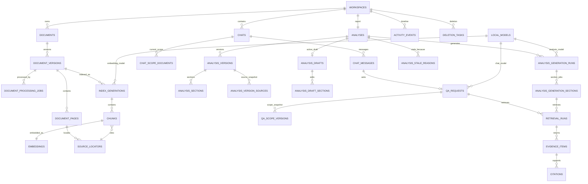

# LexLocal — Data Model

**Document ID:** `05_DATA_MODEL.md`  
**Status:** Approved implementation baseline  
**Applies to:** First complete LexLocal release  
**Depends on:** `01_PROJECT_CHARTER.md`, `02_SCOPE_AND_MVP.md`, `03_USER_FLOWS_AND_STATES.md`, `04_SYSTEM_ARCHITECTURE.md`  
**Database technology:** SQLite through Python's built-in `sqlite3` module

---

## 1. Purpose and Authority

This document converts the approved LexLocal product scope, user flows, state machines, and system architecture into a concrete persistence model.

It defines:

- the SQLite schema and table responsibilities,
- stable identifiers and ownership rules,
- workspace isolation,
- document and document-version persistence,
- page, chunk, embedding, and retrieval records,
- chat, message, scope, evidence, and citation records,
- structured-analysis drafts and immutable versions,
- model and processing metadata,
- activity and recovery records,
- uniqueness, foreign-key, and indexing requirements,
- deletion and tombstone behavior,
- transaction boundaries,
- encrypted-payload boundaries,
- migration rules,
- and implementation acceptance criteria.

This document is authoritative for database structure. If a future implementation choice conflicts with this file, the implementation must be corrected or this document must be deliberately revised.

Exact cryptographic algorithms, key derivation, key wrapping, Touch ID integration, and recovery-key mechanics remain the authority of `06_SECURITY_DESIGN.md`. This document reserves the required persistence boundaries without inventing cryptographic details.

---

## 2. Final Data-Model Decisions

The following decisions are fixed.

| Area | Decision |
|---|---|
| Database topology | One local SQLite database per operating-system user profile / LexLocal installation |
| Workspace storage | All local workspaces share that database and are isolated by mandatory `workspace_id` scope |
| Cross-device sharing | None in the first release |
| Database API | Python built-in `sqlite3`; no SQLAlchemy, SQLModel, or Alembic |
| Migration mechanism | Numbered, forward-only SQL migration files with checksum verification |
| Identifiers | Application-generated UUID strings |
| Time storage | UTC ISO-8601 timestamps with millisecond precision |
| Enum storage | Uppercase text values validated by application code and `CHECK` constraints where practical |
| Sensitive values | Encrypted before reaching `sqlite3` |
| Source files | Encrypted controlled files on disk; SQLite stores metadata and relative references |
| Embeddings | Normalized `float32` vectors stored as protected SQLite BLOB payloads |
| Retrieval baseline | Vectors loaded from SQLite and ranked with Python/NumPy cosine similarity |
| Duplicate detection | SHA-256 is computed; a workspace-scoped deterministic duplicate fingerprint enforces equality checks |
| Same file in another workspace | Allowed |
| Same file twice in one workspace | Rejected |
| Document deletion | Sensitive source and derived data are purged; minimal document/version tombstones remain |
| Historical citations | Never redirected to another version or source |
| Formal analysis versions | Immutable |
| Chat answers | Persist exact document-version scope and validated evidence |
| Active document version | At most one per logical document |
| Active index generation | At most one per document version |
| Normal UI deletion | Never hard-deletes history needed to explain a completed operation without an explicit permanent-delete flow |

---

## 3. Database Topology

LexLocal is an offline-first, single-user desktop application.

```text
macOS user account
└── LexLocal application data
    ├── lexlocal.db
    ├── encrypted controlled source files
    ├── model/runtime metadata
    ├── safe diagnostics
    └── temporary staging area
```

A different operating-system account receives a different application-data directory and a separate database. Another computer also has a separate database.

The first release does not include:

- a central server database,
- cloud synchronization,
- multi-device synchronization,
- shared network-database access,
- multi-user concurrent editing,
- or cross-device workspace transfer.

All workspace-owned tables contain a non-null `workspace_id`. Repository methods must require workspace scope instead of accepting an optional workspace filter.

---

## 4. Naming and Storage Conventions

### 4.1 Table and column naming

- Table names use plural `snake_case`.
- Column names use `snake_case`.
- Primary keys use `id`.
- Foreign keys use `<entity>_id`.
- Timestamps use `<event>_at`.
- Encrypted fields use a semantic name plus `_ciphertext` only where that improves clarity.
- Boolean values are stored as integer `0` or `1` with `CHECK` constraints.
- JSON is stored as UTF-8 text only for bounded metadata that is not queried relationally.

### 4.2 Identifiers

All durable domain entities use application-generated UUID strings.

Reasons:

- identifiers can be created before transaction commit,
- file paths can be allocated before database activation,
- IDs do not reveal record counts,
- historical references remain stable,
- future export/import can remap conflicts explicitly,
- and UI, worker, repository, and activity records can use the same identifier.

IDs are stored as `TEXT NOT NULL`.

### 4.3 Timestamps

Timestamps are stored as UTC ISO-8601 text, for example:

```text
2026-07-27T16:42:18.391Z
```

The UI converts timestamps to the user's local timezone.

### 4.4 Row immutability

The following are immutable after completed commit:

- formal chat messages,
- completed Q&A scope snapshots,
- evidence items used by a completed answer,
- completed citations,
- analysis versions,
- analysis-version sections,
- analysis-version source snapshots,
- activity events.

Corrections create new records or new versions rather than modifying historical truth.

---

## 5. SQLite Connection Rules

Every opened connection applies:

```sql
PRAGMA foreign_keys = ON;
PRAGMA journal_mode = WAL;
PRAGMA busy_timeout = 5000;
```

The final durability setting will be selected with the security design, but the default release candidate should use:

```sql
PRAGMA synchronous = NORMAL;
```

A connection:

- is never shared across worker threads,
- is created through `DatabaseConnectionFactory`,
- is owned by one unit-of-work or bounded read operation,
- is closed deterministically,
- and never escapes into presentation-layer objects.

Short activation and deletion transactions may use:

```sql
BEGIN IMMEDIATE;
```

This prevents a competing writer from changing the same active pointer during a critical state transition.

---

## 6. Schema Overview

The schema is divided into nine groups.

1. Application and migration metadata
2. Security and key metadata
3. Workspace metadata
4. Controlled blobs and documents
5. Processing, pages, chunks, indexes, and embeddings
6. Chats, messages, scopes, retrieval, evidence, and citations
7. Structured analyses, drafts, versions, and staleness
8. Models and configuration identity
9. Activity, deletion, and recovery

---

## 7. Entity-Relationship Overview



---

# PART I — APPLICATION, MIGRATION, AND SECURITY METADATA

## 8. `schema_migrations`

Tracks every applied forward migration.

| Column | Type | Rules |
|---|---|---|
| `version` | INTEGER | Primary key |
| `name` | TEXT | Not null |
| `checksum_sha256` | TEXT | Not null |
| `applied_at` | TEXT | Not null |
| `execution_ms` | INTEGER | Not null, non-negative |

Rules:

- versions are strictly increasing,
- a changed checksum for an already-applied migration blocks normal startup,
- downgrade migrations are not implemented in the first release.

---

## 9. `application_metadata`

Stores non-sensitive singleton application metadata.

| Column | Type | Rules |
|---|---|---|
| `key` | TEXT | Primary key |
| `value_json` | TEXT | Not null |
| `updated_at` | TEXT | Not null |

Allowed examples:

- first-run completion state,
- current schema compatibility marker,
- application installation ID,
- last clean shutdown timestamp,
- last successful integrity-check timestamp.

Passwords, keys, recovery secrets, document text, prompts, or user questions must never be stored here.

---

## 10. `user_preferences`

Stores validated, non-sensitive user preferences.

| Column | Type | Rules |
|---|---|---|
| `key` | TEXT | Primary key |
| `value_json` | TEXT | Not null |
| `updated_at` | TEXT | Not null |

Examples:

- appearance,
- inactivity-lock duration,
- preferred OCR languages,
- source-panel width,
- last opened workspace ID,
- non-sensitive UI layout preferences.

A preference is not authoritative for security-critical behavior unless validated against packaged policy.

---

## 11. `security_profiles`

A singleton record containing security-state metadata.

| Column | Type | Rules |
|---|---|---|
| `id` | TEXT | Primary key |
| `profile_version` | INTEGER | Not null |
| `password_kdf_metadata_json` | TEXT | Not null |
| `password_wrapped_master_key` | BLOB | Not null |
| `recovery_wrapped_master_key` | BLOB | Not null |
| `recovery_verifier` | BLOB | Not null |
| `touch_id_enabled` | INTEGER | Not null, default 0 |
| `failed_attempt_count` | INTEGER | Not null, default 0 |
| `delay_until` | TEXT | Nullable |
| `created_at` | TEXT | Not null |
| `updated_at` | TEXT | Not null |

Important:

- the table contains no plaintext password or recovery key,
- exact KDF, wrapping, verifier, and Touch ID rules belong to `06_SECURITY_DESIGN.md`,
- the table must contain exactly one active profile after setup.

---

## 12. `workspace_key_records`

Stores one wrapped data-key record per workspace.

| Column | Type | Rules |
|---|---|---|
| `workspace_id` | TEXT | Primary key, FK to `workspaces` |
| `key_version` | INTEGER | Not null |
| `wrapped_data_key` | BLOB | Nullable after cryptographic destruction |
| `status` | TEXT | `ACTIVE`, `ROTATING`, `DESTROYED` |
| `created_at` | TEXT | Not null |
| `rotated_at` | TEXT | Nullable |
| `destroyed_at` | TEXT | Nullable |

A workspace cannot enter normal `ACTIVE` or `ARCHIVED` access without a valid active key record.

Workspace deletion destroys the workspace data key and then sets the key record to `DESTROYED` or removes it according to the finalized security design. A minimal destruction receipt may remain.

---

# PART II — WORKSPACES

## 13. `workspaces`

Represents an isolated legal matter.

| Column | Type | Rules |
|---|---|---|
| `id` | TEXT | Primary key |
| `name_ciphertext` | BLOB | Not null |
| `name_lookup_fingerprint` | BLOB | Not null |
| `state` | TEXT | `ACTIVE`, `ARCHIVED`, `DELETING`, `DELETION_RECOVERY` |
| `profile` | TEXT | Nullable: `LITIGATION`, `CONTRACT_REVIEW`, `GENERAL_LEGAL` |
| `profile_source` | TEXT | Nullable: `USER`, `AI_CONFIRMED` |
| `suggested_profile` | TEXT | Nullable |
| `suggested_profile_model_id` | TEXT | Nullable FK to `local_models` |
| `profile_suggested_at` | TEXT | Nullable |
| `profile_confirmed_at` | TEXT | Nullable |
| `created_at` | TEXT | Not null |
| `updated_at` | TEXT | Not null |
| `archived_at` | TEXT | Nullable |
| `deletion_started_at` | TEXT | Nullable |

Notes:

- The visible workspace name is sensitive and encrypted.
- `name_lookup_fingerprint` supports exact duplicate-name checks without storing plaintext. Exact cryptographic construction belongs to `06_SECURITY_DESIGN.md`.
- `DELETED` is represented by removal after deletion completes. A separate deletion receipt/activity event can remain.
- A workspace in `DELETING` or `DELETION_RECOVERY` is not returned by normal workspace queries.

Indexes:

```sql
CREATE INDEX ix_workspaces_state_updated
ON workspaces(state, updated_at DESC);
```

---

## 14. Workspace invariants

1. Every workspace-owned record has a non-null `workspace_id`.
2. Normal mutation requires workspace state `ACTIVE`.
3. `ARCHIVED` is read-only.
4. `DELETING` and `DELETION_RECOVERY` block normal access.
5. Repository calls cannot retrieve records from another workspace unless using an explicit application-level administrative query.
6. The first release has no such user-facing cross-workspace query.

---

# PART III — CONTROLLED STORAGE AND DOCUMENTS

## 15. `stored_blobs`

Tracks controlled encrypted files stored outside SQLite.

| Column | Type | Rules |
|---|---|---|
| `id` | TEXT | Primary key |
| `workspace_id` | TEXT | Not null, FK to `workspaces` |
| `kind` | TEXT | `SOURCE_DOCUMENT`, `SOURCE_IMAGE`, `THUMBNAIL`, `DERIVED_ARTIFACT` |
| `relative_path` | TEXT | Not null |
| `state` | TEXT | `STAGING`, `ACTIVE`, `DELETING`, `DELETED` |
| `size_bytes` | INTEGER | Not null, non-negative |
| `plaintext_sha256_ciphertext` | BLOB | Nullable |
| `duplicate_fingerprint` | BLOB | Nullable |
| `encryption_format_version` | INTEGER | Not null |
| `created_at` | TEXT | Not null |
| `activated_at` | TEXT | Nullable |
| `deleted_at` | TEXT | Nullable |

Constraints:

```sql
UNIQUE(workspace_id, relative_path)
```

A blob is not exposed as usable until `state = 'ACTIVE'`.

Temporary files that can be safely discarded do not need permanent database rows. Durable staging files do.

---

## 16. `documents`

Represents a logical document independent of versions.

| Column | Type | Rules |
|---|---|---|
| `id` | TEXT | Primary key |
| `workspace_id` | TEXT | Not null, FK to `workspaces` |
| `display_name_ciphertext` | BLOB | Not null |
| `state` | TEXT | `ACTIVE`, `DELETED` |
| `confirmed_type` | TEXT | Nullable |
| `type_source` | TEXT | Nullable: `USER`, `AI_CONFIRMED` |
| `suggested_type` | TEXT | Nullable |
| `suggested_type_model_id` | TEXT | Nullable FK to `local_models` |
| `type_suggested_at` | TEXT | Nullable |
| `type_confirmed_at` | TEXT | Nullable |
| `created_at` | TEXT | Not null |
| `updated_at` | TEXT | Not null |
| `deleted_at` | TEXT | Nullable |

Suggested first-release document types:

- `PETITION`
- `RESPONSE`
- `CONTRACT`
- `EXPERT_REPORT`
- `COURT_DECISION`
- `NOTICE`
- `EVIDENCE_ATTACHMENT`
- `OTHER`

Tombstone behavior:

- `state` becomes `DELETED`,
- the historical display name may remain encrypted,
- type suggestions and nonessential metadata may be cleared,
- all source and derived content is purged through version deletion.

Index:

```sql
CREATE INDEX ix_documents_workspace_state
ON documents(workspace_id, state, updated_at DESC);
```

---

## 17. `document_versions`

Represents an exact source file revision.

| Column | Type | Rules |
|---|---|---|
| `id` | TEXT | Primary key |
| `workspace_id` | TEXT | Not null |
| `document_id` | TEXT | Not null, FK to `documents` |
| `version_number` | INTEGER | Not null, starts at 1 |
| `historical_filename_ciphertext` | BLOB | Not null |
| `mime_type` | TEXT | Nullable after deletion |
| `file_extension` | TEXT | Nullable after deletion |
| `byte_size` | INTEGER | Nullable after deletion |
| `page_count` | INTEGER | Nullable after deletion |
| `source_blob_id` | TEXT | Nullable FK to `stored_blobs` |
| `content_sha256_ciphertext` | BLOB | Nullable |
| `duplicate_fingerprint` | BLOB | Nullable |
| `state` | TEXT | Version state |
| `warning_summary_ciphertext` | BLOB | Nullable |
| `created_at` | TEXT | Not null |
| `activated_at` | TEXT | Nullable |
| `archived_at` | TEXT | Nullable |
| `deleted_at` | TEXT | Nullable |

Allowed states:

- `CANDIDATE_PROCESSING`
- `CANDIDATE_READY`
- `CANDIDATE_WARNING`
- `CANDIDATE_FAILED`
- `CANDIDATE_CANCELLED`
- `ACTIVE`
- `ARCHIVED`
- `DELETED`

Constraints:

```sql
UNIQUE(document_id, version_number)
```

Partial unique indexes:

```sql
CREATE UNIQUE INDEX ux_document_one_active_version
ON document_versions(document_id)
WHERE state = 'ACTIVE';

CREATE UNIQUE INDEX ux_workspace_duplicate_live_source
ON document_versions(workspace_id, duplicate_fingerprint)
WHERE duplicate_fingerprint IS NOT NULL
  AND state <> 'DELETED';
```

Duplicate rule:

- SHA-256 is computed for every accepted source.
- The raw digest can be retained only in protected form.
- A deterministic workspace-scoped fingerprint derived from that digest is used for equality and the unique index.
- The same content may exist in another workspace.
- Selecting the active version again or any still-retained archived version does not create a new version.
- After permanent deletion clears the live duplicate fingerprint, the user may add the source again as a new document.

Tombstone rule:

When permanently deleted, the row retains only what historical citations require:

- `id`
- `workspace_id`
- `document_id`
- `version_number`
- encrypted historical filename
- `state = DELETED`
- `deleted_at`

The source blob reference, MIME data, hashes, size, warning text, page count, and all derived records are cleared or deleted.

---

## 18. Version activation invariant

A replacement follows this order:

1. create candidate version,
2. store and validate source,
3. process pages,
4. build chunks and embeddings in a staging index generation,
5. validate candidate completeness,
6. if warnings exist, obtain user activation approval,
7. enter an immediate transaction,
8. archive current active version,
9. activate candidate version and index generation,
10. commit,
11. publish activity events.

If any step before activation fails, the old version remains active.

---

# PART IV — PROCESSING, PAGES, CHUNKS, AND EMBEDDINGS

## 19. `document_processing_jobs`

Tracks one processing attempt for one document version.

| Column | Type | Rules |
|---|---|---|
| `id` | TEXT | Primary key |
| `workspace_id` | TEXT | Not null |
| `document_version_id` | TEXT | Not null, FK |
| `attempt_number` | INTEGER | Not null |
| `state` | TEXT | Job state |
| `stage` | TEXT | Current pipeline stage |
| `progress_current` | INTEGER | Nullable |
| `progress_total` | INTEGER | Nullable |
| `cancel_requested` | INTEGER | Not null, default 0 |
| `error_code` | TEXT | Nullable |
| `error_metadata_json` | TEXT | Nullable, sanitized |
| `started_at` | TEXT | Nullable |
| `heartbeat_at` | TEXT | Nullable |
| `completed_at` | TEXT | Nullable |
| `created_at` | TEXT | Not null |

Allowed job states:

- `QUEUED`
- `PROCESSING`
- `READY`
- `READY_WITH_WARNINGS`
- `FAILED`
- `CANCELLED`

Suggested stages:

- `VALIDATING`
- `COPYING_SOURCE`
- `EXTRACTING_NATIVE_TEXT`
- `RENDERING_PAGES`
- `RUNNING_OCR`
- `NORMALIZING_TEXT`
- `CHUNKING`
- `EMBEDDING`
- `VALIDATING_INDEX`
- `ACTIVATING`
- `CLEANING_UP`

Constraints:

```sql
UNIQUE(document_version_id, attempt_number)
```

Index:

```sql
CREATE INDEX ix_processing_jobs_recovery
ON document_processing_jobs(state, heartbeat_at);
```

A startup recovery query looks for stale `PROCESSING` jobs.

Each row is one immutable processing attempt. `READY`,
`READY_WITH_WARNINGS`, `FAILED`, and `CANCELLED` are terminal states for that
row. Retrying or reprocessing the same document version inserts a new row with
a new application-generated identifier and the next positive
`attempt_number`; it does not update a terminal row back to `QUEUED` or
`PROCESSING`. Allocation of the next attempt number and insertion of the new
attempt occur together in a later application use-case/repository transaction.

---

## 20. `document_pages`

Stores page-level extraction results.

| Column | Type | Rules |
|---|---|---|
| `id` | TEXT | Primary key |
| `workspace_id` | TEXT | Not null |
| `document_version_id` | TEXT | Not null, FK |
| `page_number` | INTEGER | Not null, one-based |
| `state` | TEXT | `READY`, `WARNING`, `FAILED` |
| `extraction_method` | TEXT | `NATIVE`, `OCR` |
| `text_ciphertext` | BLOB | Nullable for failed page |
| `normalized_text_fingerprint` | BLOB | Nullable; workspace-scoped keyed fingerprint |
| `character_count` | INTEGER | Not null, default 0 |
| `word_count` | INTEGER | Not null, default 0 |
| `warning_codes_json` | TEXT | Nullable |
| `created_at` | TEXT | Not null |
| `updated_at` | TEXT | Not null |

Constraints:

```sql
UNIQUE(document_version_id, page_number)
CHECK(page_number >= 1)
```

Only `READY` and `WARNING` pages may produce active chunks.

---

## 21. `source_locators`

Stores stable page and optional geometry information.

| Column | Type | Rules |
|---|---|---|
| `id` | TEXT | Primary key |
| `workspace_id` | TEXT | Not null |
| `document_version_id` | TEXT | Not null, FK |
| `page_id` | TEXT | Not null, FK to `document_pages` |
| `locator_kind` | TEXT | `PAGE`, `PDF_TEXT_BOUNDS`, `OCR_BOUNDS`, `IMAGE_REGION` |
| `page_number` | INTEGER | Not null |
| `geometry_json_ciphertext` | BLOB | Nullable |
| `locator_version` | INTEGER | Not null |
| `created_at` | TEXT | Not null |

The viewer must not invent geometry. A page-only locator is valid.

Index:

```sql
CREATE INDEX ix_source_locators_version_page
ON source_locators(document_version_id, page_number);
```

---

## 22. `index_generations`

Groups a reproducible set of chunks and embeddings.

| Column | Type | Rules |
|---|---|---|
| `id` | TEXT | Primary key |
| `workspace_id` | TEXT | Not null |
| `document_version_id` | TEXT | Not null, FK |
| `processing_job_id` | TEXT | Not null, FK |
| `state` | TEXT | `STAGING`, `ACTIVE`, `ARCHIVED`, `FAILED` |
| `embedding_model_id` | TEXT | Not null, FK to `local_models` |
| `chunking_profile_version` | TEXT | Not null |
| `normalization_profile_version` | TEXT | Not null |
| `embedding_dimensions` | INTEGER | Not null |
| `vector_dtype` | TEXT | Must be `float32` for baseline |
| `chunk_count` | INTEGER | Not null, default 0 |
| `created_at` | TEXT | Not null |
| `activated_at` | TEXT | Nullable |
| `archived_at` | TEXT | Nullable |

Partial unique index:

```sql
CREATE UNIQUE INDEX ux_version_one_active_index
ON index_generations(document_version_id)
WHERE state = 'ACTIVE';
```

A generation is retrieval-eligible only when:

- its state is `ACTIVE`,
- its document version is `ACTIVE`,
- its workspace is `ACTIVE`,
- and its embedding model is compatible with the query model.

---

## 23. `chunks`

Stores page-scoped retrievable text.

| Column | Type | Rules |
|---|---|---|
| `id` | TEXT | Primary key |
| `workspace_id` | TEXT | Not null |
| `index_generation_id` | TEXT | Not null, FK |
| `document_version_id` | TEXT | Not null, FK |
| `page_id` | TEXT | Not null, FK |
| `source_locator_id` | TEXT | Not null, FK |
| `document_order` | INTEGER | Not null |
| `page_order` | INTEGER | Not null |
| `text_ciphertext` | BLOB | Not null |
| `normalized_text_fingerprint` | BLOB | Not null; workspace-scoped keyed fingerprint |
| `character_count` | INTEGER | Not null |
| `token_count_estimate` | INTEGER | Nullable |
| `extraction_method` | TEXT | `NATIVE`, `OCR` |
| `created_at` | TEXT | Not null |

Constraints:

```sql
UNIQUE(index_generation_id, document_order)
CHECK(document_order >= 0)
CHECK(page_order >= 0)
```

Indexes:

```sql
CREATE INDEX ix_chunks_generation
ON chunks(index_generation_id, document_order);

CREATE INDEX ix_chunks_version_page
ON chunks(document_version_id, page_id, page_order);
```

Chunk text remains encrypted at rest.

---

## 24. `embeddings`

Stores one embedding vector per chunk for one index generation.

| Column | Type | Rules |
|---|---|---|
| `chunk_id` | TEXT | Primary key, FK to `chunks` |
| `workspace_id` | TEXT | Not null |
| `index_generation_id` | TEXT | Not null, FK |
| `embedding_model_id` | TEXT | Not null, FK |
| `dimensions` | INTEGER | Not null |
| `dtype` | TEXT | `float32` |
| `is_unit_normalized` | INTEGER | Must be 1 |
| `vector_ciphertext` | BLOB | Not null |
| `created_at` | TEXT | Not null |

Constraints:

```sql
CHECK(dimensions > 0)
CHECK(dtype = 'float32')
CHECK(is_unit_normalized = 1)
```

Indexes:

```sql
CREATE INDEX ix_embeddings_generation
ON embeddings(index_generation_id);
```

Vector validation before insert:

- expected dimension,
- finite values only,
- non-zero norm,
- normalized to unit length,
- deterministic byte order.

---

## 25. Processing deletion behavior

Permanent document deletion:

1. marks logical document/version blocked for new use,
2. invalidates in-memory vector caches,
3. deletes embeddings,
4. deletes chunks,
5. deletes source locators,
6. deletes page text,
7. archives/purges index-generation and job details as allowed,
8. deletes source blobs,
9. clears sensitive version metadata,
10. converts document/version rows into tombstones,
11. updates citations to `SOURCE_DELETED`,
12. marks affected analyses stale where still applicable,
13. commits an activity event.

Processing jobs may be retained with sanitized status metadata or purged according to retention policy. They must never retain extracted text or raw error payloads.

---

# PART V — LOCAL MODEL IDENTITY

## 26. `local_models`

Records exact local model identities resolved from configured aliases.

| Column | Type | Rules |
|---|---|---|
| `id` | TEXT | Primary key |
| `role` | TEXT | `CHAT`, `EMBEDDING` |
| `requested_alias` | TEXT | Not null |
| `resolved_model_id` | TEXT | Not null |
| `model_version` | TEXT | Nullable |
| `runtime_provider` | TEXT | Nullable |
| `embedding_dimensions` | INTEGER | Nullable, required for embedding role |
| `state` | TEXT | `DISCOVERED`, `READY`, `ERROR`, `REMOVED` |
| `verified_at` | TEXT | Nullable |
| `created_at` | TEXT | Not null |
| `updated_at` | TEXT | Not null |

Constraint:

```sql
UNIQUE(role, resolved_model_id, model_version)
```

Every index generation and completed AI operation stores the exact model record used. Alias alone is not sufficient historical identity.

---

# PART VI — CHATS, Q&A, RETRIEVAL, EVIDENCE, AND CITATIONS

## 27. `chats`

Represents one persistent conversation in one workspace.

| Column | Type | Rules |
|---|---|---|
| `id` | TEXT | Primary key |
| `workspace_id` | TEXT | Not null, FK |
| `title_ciphertext` | BLOB | Not null |
| `title_source` | TEXT | `DEFAULT`, `AUTO`, `MANUAL` |
| `state` | TEXT | `EMPTY_DRAFT`, `ACTIVE`, `DELETING` |
| `created_at` | TEXT | Not null |
| `updated_at` | TEXT | Not null |
| `deleted_at` | TEXT | Nullable |

An abandoned `EMPTY_DRAFT` may be removed without confirmation. An `ACTIVE` chat requires confirmed deletion.

Index:

```sql
CREATE INDEX ix_chats_workspace_updated
ON chats(workspace_id, updated_at DESC);
```

---

## 28. `chat_scope_documents`

Stores the current logical-document scope of a chat.

| Column | Type | Rules |
|---|---|---|
| `chat_id` | TEXT | FK to `chats` |
| `workspace_id` | TEXT | Not null |
| `document_id` | TEXT | FK to `documents` |
| `added_at` | TEXT | Not null |
| `added_by` | TEXT | `DEFAULT`, `USER`, `NEW_DOCUMENT_PROMPT` |

Primary key:

```sql
PRIMARY KEY(chat_id, document_id)
```

This table contains logical document IDs, not fixed versions.

Therefore:

- replacing a selected document with a new active version affects future questions,
- adding an entirely new document does not automatically add it to an existing chat,
- removing a document from chat scope affects only future questions,
- every request still stores an exact version snapshot separately.

---

## 29. `chat_messages`

Stores immutable completed messages and explicit system timeline entries.

| Column | Type | Rules |
|---|---|---|
| `id` | TEXT | Primary key |
| `workspace_id` | TEXT | Not null |
| `chat_id` | TEXT | Not null, FK |
| `sequence_number` | INTEGER | Not null |
| `role` | TEXT | `USER`, `ASSISTANT`, `SYSTEM_EVENT` |
| `content_ciphertext` | BLOB | Not null |
| `message_kind` | TEXT | `QUESTION`, `ANSWER`, `EVIDENCE_NOTICE`, `SCOPE_CHANGE`, `GENERAL` |
| `created_at` | TEXT | Not null |

Constraints:

```sql
UNIQUE(chat_id, sequence_number)
```

A failed or cancelled assistant generation does not create an assistant message. The preserved user question remains linked to a failed/cancelled request.

---

## 30. `chat_context_summaries`

Stores controlled local summaries for long conversations.

| Column | Type | Rules |
|---|---|---|
| `id` | TEXT | Primary key |
| `workspace_id` | TEXT | Not null |
| `chat_id` | TEXT | Not null, FK |
| `through_sequence_number` | INTEGER | Not null |
| `summary_ciphertext` | BLOB | Not null |
| `model_id` | TEXT | Nullable FK to `local_models` |
| `summary_schema_version` | TEXT | Not null |
| `created_at` | TEXT | Not null |

Only the latest valid summary needed by context construction must be loaded. A conversation summary helps interpret follow-up language but is never legal evidence.

---

## 31. `qa_requests`

Represents one question-answer operation.

| Column | Type | Rules |
|---|---|---|
| `id` | TEXT | Primary key |
| `workspace_id` | TEXT | Not null |
| `chat_id` | TEXT | Not null, FK |
| `question_message_id` | TEXT | Not null, FK |
| `answer_message_id` | TEXT | Nullable FK |
| `state` | TEXT | Q&A state |
| `evidence_state` | TEXT | Nullable |
| `chat_model_id` | TEXT | Nullable FK to `local_models` |
| `prompt_contract_version` | TEXT | Nullable |
| `top_k` | INTEGER | Nullable |
| `evidence_policy_version` | TEXT | Nullable |
| `error_code` | TEXT | Nullable |
| `error_metadata_json` | TEXT | Nullable, sanitized |
| `created_at` | TEXT | Not null |
| `started_at` | TEXT | Nullable |
| `completed_at` | TEXT | Nullable |

Allowed states:

- `DRAFT`
- `SEARCHING`
- `EVALUATING_EVIDENCE`
- `GENERATING`
- `VALIDATING_CITATIONS`
- `COMPLETED`
- `COMPLETED_INSUFFICIENT`
- `FAILED`
- `CANCELLED`

Evidence states:

- `SUFFICIENT`
- `RELATED_BUT_INSUFFICIENT`
- `INSUFFICIENT`

A completed request must have an answer message. A failed or cancelled request must not have a completed answer message.

---

## 32. `qa_scope_versions`

Stores the exact document-version snapshot used by one request.

| Column | Type | Rules |
|---|---|---|
| `qa_request_id` | TEXT | FK to `qa_requests` |
| `workspace_id` | TEXT | Not null |
| `document_id` | TEXT | Not null, FK |
| `document_version_id` | TEXT | Not null, FK |
| `included_at` | TEXT | Not null |

Primary key:

```sql
PRIMARY KEY(qa_request_id, document_version_id)
```

The snapshot is created before retrieval begins and is immutable after request completion.

---

## 33. `analysis_generation_runs`

Tracks a full or partial structured-analysis generation operation.

| Column | Type | Rules |
|---|---|---|
| `id` | TEXT | Primary key |
| `workspace_id` | TEXT | Not null |
| `analysis_id` | TEXT | Not null, FK |
| `run_type` | TEXT | `INITIAL`, `FULL_REGENERATION`, `SECTION_REGENERATION` |
| `target_section_key` | TEXT | Nullable |
| `state` | TEXT | `QUEUED`, `GENERATING`, `VALIDATING`, `COMPLETED`, `FAILED`, `CANCELLED` |
| `profile` | TEXT | Not null |
| `chat_model_id` | TEXT | Nullable FK |
| `prompt_schema_version` | TEXT | Not null |
| `error_code` | TEXT | Nullable |
| `error_metadata_json` | TEXT | Nullable |
| `created_at` | TEXT | Not null |
| `started_at` | TEXT | Nullable |
| `completed_at` | TEXT | Nullable |

A run never overwrites the last valid formal analysis until all required output and citations validate.

---

## 34. `analysis_generation_sections`

Tracks generation of individual sections.

| Column | Type | Rules |
|---|---|---|
| `id` | TEXT | Primary key |
| `workspace_id` | TEXT | Not null |
| `generation_run_id` | TEXT | Not null, FK |
| `section_key` | TEXT | Not null |
| `section_order` | INTEGER | Not null |
| `state` | TEXT | `PENDING`, `RETRIEVING`, `GENERATING`, `VALIDATING`, `COMPLETED`, `FAILED`, `CANCELLED` |
| `error_code` | TEXT | Nullable |
| `created_at` | TEXT | Not null |
| `completed_at` | TEXT | Nullable |

Constraint:

```sql
UNIQUE(generation_run_id, section_key)
```

---

## 35. `retrieval_runs`

Stores the exact retrieval configuration used for a Q&A request or analysis section.

| Column | Type | Rules |
|---|---|---|
| `id` | TEXT | Primary key |
| `workspace_id` | TEXT | Not null |
| `purpose` | TEXT | `QA`, `ANALYSIS_SECTION` |
| `qa_request_id` | TEXT | Nullable FK |
| `analysis_generation_section_id` | TEXT | Nullable FK |
| `query_ciphertext` | BLOB | Not null |
| `embedding_model_id` | TEXT | Not null, FK |
| `top_k` | INTEGER | Not null |
| `candidate_count` | INTEGER | Not null |
| `retrieval_policy_version` | TEXT | Not null |
| `created_at` | TEXT | Not null |

Owner check:

```sql
CHECK (
    (qa_request_id IS NOT NULL AND analysis_generation_section_id IS NULL)
 OR (qa_request_id IS NULL AND analysis_generation_section_id IS NOT NULL)
)
```

The query may be a transformed section query rather than raw user text. It remains protected.

---

## 36. `evidence_items`

Stores ranked retrieval evidence.

| Column | Type | Rules |
|---|---|---|
| `id` | TEXT | Primary key |
| `workspace_id` | TEXT | Not null |
| `retrieval_run_id` | TEXT | Not null, FK |
| `evidence_code` | TEXT | Not null, for example `E1` |
| `rank` | INTEGER | Not null |
| `similarity_score` | REAL | Not null |
| `chunk_id` | TEXT | Nullable FK with `ON DELETE SET NULL` |
| `source_locator_id` | TEXT | Nullable FK with `ON DELETE SET NULL` |
| `document_id` | TEXT | Not null, FK |
| `document_version_id` | TEXT | Not null, FK to retained/tombstoned version |
| `page_number_snapshot` | INTEGER | Nullable |
| `document_name_snapshot_ciphertext` | BLOB | Not null |
| `version_number_snapshot` | INTEGER | Not null |
| `supporting_excerpt_ciphertext` | BLOB | Nullable |
| `availability` | TEXT | `AVAILABLE`, `SOURCE_DELETED` |
| `created_at` | TEXT | Not null |

Constraints:

```sql
UNIQUE(retrieval_run_id, evidence_code)
UNIQUE(retrieval_run_id, rank)
```

The model receives evidence codes, not permission to invent citations.

When a source is permanently deleted:

- `chunk_id` and `source_locator_id` become null,
- `supporting_excerpt_ciphertext` is cleared,
- `availability` becomes `SOURCE_DELETED`,
- version, page, and display snapshots remain,
- the citation reports that the source can no longer be viewed.

---

## 37. `citations`

Connects validated evidence to a completed answer or immutable analysis section.

| Column | Type | Rules |
|---|---|---|
| `id` | TEXT | Primary key |
| `workspace_id` | TEXT | Not null |
| `evidence_item_id` | TEXT | Not null, FK |
| `answer_message_id` | TEXT | Nullable FK to `chat_messages` |
| `analysis_section_id` | TEXT | Nullable FK to `analysis_sections` |
| `citation_number` | INTEGER | Not null |
| `status` | TEXT | `VALID`, `SOURCE_DELETED` |
| `created_at` | TEXT | Not null |

Target check:

```sql
CHECK (
    (answer_message_id IS NOT NULL AND analysis_section_id IS NULL)
 OR (answer_message_id IS NULL AND analysis_section_id IS NOT NULL)
)
```

Constraints:

```sql
UNIQUE(answer_message_id, citation_number)
UNIQUE(analysis_section_id, citation_number)
```

A citation cannot be committed until its evidence item is validated against an eligible exact document version.

---

## 38. Atomic Q&A commit

A successful Q&A commit transaction creates or finalizes together:

- the immutable question message if not already committed,
- exact scope snapshot,
- retrieval-run metadata,
- ranked evidence items,
- assistant answer message,
- validated citations,
- completed request state,
- safe activity event.

If citation validation fails, no completed assistant answer becomes visible.

---

# PART VII — STRUCTURED ANALYSIS

## 39. `analyses`

Represents the one persistent structured report for a workspace.

| Column | Type | Rules |
|---|---|---|
| `id` | TEXT | Primary key |
| `workspace_id` | TEXT | Not null, unique FK |
| `state` | TEXT | `NOT_CREATED`, `CURRENT`, `STALE` |
| `current_version_id` | TEXT | Nullable FK to `analysis_versions` |
| `active_draft_id` | TEXT | Nullable FK to `analysis_drafts` |
| `created_at` | TEXT | Not null |
| `updated_at` | TEXT | Not null |
| `stale_at` | TEXT | Nullable |

Generation failure and cancellation are operation states stored in generation runs. They do not replace the last valid report state.

---

## 40. `analysis_generation_sources`

Stores the exact source set selected at analysis preflight.

| Column | Type | Rules |
|---|---|---|
| `generation_run_id` | TEXT | FK |
| `workspace_id` | TEXT | Not null |
| `document_id` | TEXT | Not null |
| `document_version_id` | TEXT | Not null |
| `coverage_state` | TEXT | `FULL`, `PARTIAL` |
| `warning_snapshot_ciphertext` | BLOB | Nullable |

Primary key:

```sql
PRIMARY KEY(generation_run_id, document_version_id)
```

---

## 41. `analysis_versions`

Stores immutable formal report versions.

| Column | Type | Rules |
|---|---|---|
| `id` | TEXT | Primary key |
| `workspace_id` | TEXT | Not null |
| `analysis_id` | TEXT | Not null, FK |
| `version_number` | INTEGER | Not null |
| `creation_reason` | TEXT | Version reason |
| `content_source` | TEXT | `AI`, `USER`, `RESTORE`, `MIXED` |
| `profile` | TEXT | Not null |
| `profile_schema_version` | TEXT | Not null |
| `generation_run_id` | TEXT | Nullable FK |
| `based_on_version_id` | TEXT | Nullable self-FK |
| `restored_from_version_id` | TEXT | Nullable self-FK |
| `changed_sections_json` | TEXT | Not null |
| `source_set_fingerprint` | BLOB | Not null; exactly 32-byte workspace-scoped HMAC |
| `created_at` | TEXT | Not null |

Creation reasons:

- `INITIAL_GENERATION`
- `FULL_REGENERATION`
- `SECTION_REGENERATION`
- `USER_EDIT_SAVE`
- `RESTORE`

Constraints:

```sql
UNIQUE(analysis_id, version_number)
CHECK(length(source_set_fingerprint) = 32)
CHECK(
    (
        creation_reason = 'RESTORE'
        AND content_source = 'RESTORE'
        AND restored_from_version_id IS NOT NULL
        AND generation_run_id IS NULL
    )
    OR
    (
        creation_reason <> 'RESTORE'
        AND restored_from_version_id IS NULL
    )
)
```

A formal version is never updated in place.

---

## 42. `analysis_sections`

Stores immutable sections belonging to one formal version.

| Column | Type | Rules |
|---|---|---|
| `id` | TEXT | Primary key |
| `workspace_id` | TEXT | Not null |
| `analysis_version_id` | TEXT | Not null, FK |
| `section_key` | TEXT | Not null |
| `section_title_ciphertext` | BLOB | Not null |
| `section_order` | INTEGER | Not null |
| `content_ciphertext` | BLOB | Not null |
| `content_origin` | TEXT | `AI`, `USER`, `MIXED`, `RESTORED` |
| `section_schema_version` | TEXT | Not null |
| `created_at` | TEXT | Not null |

Constraints:

```sql
UNIQUE(analysis_version_id, section_key)
UNIQUE(analysis_version_id, section_order)
```

Finding-level citations and section-level citations both target this immutable section. Fine-grained anchors may be stored in citation-display metadata later without changing the ownership model.

---

## 43. `analysis_version_sources`

Stores the exact versions underlying a committed analysis version.

| Column | Type | Rules |
|---|---|---|
| `analysis_version_id` | TEXT | FK |
| `workspace_id` | TEXT | Not null |
| `document_id` | TEXT | Not null |
| `document_version_id` | TEXT | Not null |
| `coverage_state` | TEXT | `FULL`, `PARTIAL` |
| `warning_snapshot_ciphertext` | BLOB | Nullable |

Primary key:

```sql
PRIMARY KEY(analysis_version_id, document_version_id)
```

This table is independent from the workspace's current active versions. Historical analyses continue to identify their real source versions.

---

## 44. `analysis_drafts`

Stores one mutable auto-saved draft at a time per analysis.

| Column | Type | Rules |
|---|---|---|
| `id` | TEXT | Primary key |
| `workspace_id` | TEXT | Not null |
| `analysis_id` | TEXT | Not null, FK |
| `based_on_version_id` | TEXT | Not null, FK |
| `state` | TEXT | `ACTIVE`, `SAVED`, `DISCARDED` |
| `created_at` | TEXT | Not null |
| `updated_at` | TEXT | Not null |
| `saved_as_version_id` | TEXT | Nullable FK |

Partial unique index:

```sql
CREATE UNIQUE INDEX ux_analysis_one_active_draft
ON analysis_drafts(analysis_id)
WHERE state = 'ACTIVE';
```

Draft auto-save does not create formal versions.

---

## 45. `analysis_draft_sections`

Stores mutable draft section content.

| Column | Type | Rules |
|---|---|---|
| `draft_id` | TEXT | FK |
| `workspace_id` | TEXT | Not null |
| `section_key` | TEXT | Not null |
| `content_ciphertext` | BLOB | Not null |
| `is_user_modified` | INTEGER | Not null |
| `updated_at` | TEXT | Not null |

Primary key:

```sql
PRIMARY KEY(draft_id, section_key)
```

Saving a draft:

1. validates current base version,
2. creates a new immutable analysis version,
3. copies unchanged sections,
4. writes changed draft sections,
5. copies or updates citations according to validation rules,
6. marks draft `SAVED`,
7. sets the new formal version current,
8. commits an activity event.

---

## 46. `analysis_stale_reasons`

Stores why an analysis became stale.

| Column | Type | Rules |
|---|---|---|
| `id` | TEXT | Primary key |
| `workspace_id` | TEXT | Not null |
| `analysis_id` | TEXT | Not null, FK |
| `reason_type` | TEXT | Stale reason |
| `subject_type` | TEXT | `DOCUMENT`, `DOCUMENT_VERSION`, `WORKSPACE_PROFILE` |
| `subject_id` | TEXT | Nullable |
| `summary_ciphertext` | BLOB | Not null |
| `created_at` | TEXT | Not null |
| `resolved_by_version_id` | TEXT | Nullable FK |

Suggested reason types:

- `DOCUMENT_ADDED`
- `DOCUMENT_REPLACED`
- `DOCUMENT_DELETED`
- `PROFILE_CHANGED`
- `PARTIAL_COVERAGE_CHANGED`

A stale reason is resolved only when a new analysis version explicitly supersedes it.

---

## 47. Analysis restore and diff rules

Restoring an older version:

1. selects an immutable historical version,
2. copies its sections, citation relationships, and source snapshot
   deterministically into a new `analysis_versions` row,
3. does not update any existing version,
4. performs no model inference or retrieval generation,
5. sets `creation_reason = RESTORE`,
6. sets `content_source = RESTORE`,
7. stores the selected historical version in `restored_from_version_id`,
8. stores the version current before restore in `based_on_version_id`,
9. leaves `generation_run_id` null,
10. appends a safe activity event,
11. allocates the next normal `version_number`,
12. may still produce formal state `STALE` if the copied sources/profile do not
    match current workspace state.

Restore never creates an `analysis_generation_runs` row.

Diffs are computed deterministically from immutable sections and citation sets. They do not require a dedicated diff table in the first release. A short AI-generated explanation may be cached later but is not the source of truth.

---

# PART VIII — ACTIVITY, DELETION, AND RECOVERY

## 48. `activity_events`

Stores append-only user-visible workspace history.

| Column | Type | Rules |
|---|---|---|
| `id` | TEXT | Primary key |
| `workspace_id` | TEXT | Not null |
| `category` | TEXT | `WORKSPACE`, `DOCUMENT`, `CHAT`, `ANALYSIS`, `SECURITY`, `ERROR` |
| `event_type` | TEXT | Not null |
| `result_status` | TEXT | `STARTED`, `SUCCESS`, `WARNING`, `FAILED`, `CANCELLED` |
| `subject_type` | TEXT | Nullable |
| `subject_id` | TEXT | Nullable |
| `summary_key` | TEXT | Not null |
| `safe_metadata_json` | TEXT | Nullable |
| `correlation_id` | TEXT | Nullable |
| `created_at` | TEXT | Not null |

The event remains understandable if the subject is later deleted. It contains no raw document text, question, answer, prompt, password, recovery key, or encryption key.

Indexes:

```sql
CREATE INDEX ix_activity_workspace_time
ON activity_events(workspace_id, created_at DESC);

CREATE INDEX ix_activity_workspace_category
ON activity_events(workspace_id, category, created_at DESC);
```

---

## 49. `deletion_tasks`

Persists recoverable destructive operations.

| Column | Type | Rules |
|---|---|---|
| `id` | TEXT | Primary key |
| `workspace_id` | TEXT | Not null |
| `target_type` | TEXT | `DOCUMENT`, `WORKSPACE` |
| `target_id` | TEXT | Not null |
| `state` | TEXT | `PLANNED`, `IN_PROGRESS`, `FAILED`, `COMPLETED` |
| `plan_metadata_json` | TEXT | Not null, safe paths/IDs only |
| `attempt_count` | INTEGER | Not null, default 0 |
| `last_error_code` | TEXT | Nullable |
| `created_at` | TEXT | Not null |
| `started_at` | TEXT | Nullable |
| `completed_at` | TEXT | Nullable |
| `updated_at` | TEXT | Not null |

The plan must not contain plaintext sensitive content or keys.

A failed workspace deletion leaves the workspace in `DELETION_RECOVERY`.

---

## 50. `recovery_actions`

Tracks user decisions for interrupted operations.

| Column | Type | Rules |
|---|---|---|
| `id` | TEXT | Primary key |
| `workspace_id` | TEXT | Nullable |
| `operation_type` | TEXT | `DOCUMENT_PROCESSING`, `DELETION`, `DATABASE_REPAIR`, `KEY_ACCESS` |
| `operation_id` | TEXT | Nullable |
| `detected_at` | TEXT | Not null |
| `selected_action` | TEXT | Nullable |
| `resolved_at` | TEXT | Nullable |
| `result_status` | TEXT | Nullable |
| `safe_metadata_json` | TEXT | Nullable |

This table records control decisions, not repair secrets or raw diagnostic data.

`recovery_actions.workspace_id` may be null only for application-global recovery
operations such as database repair, security-profile recovery, or full
application reset. Workspace-specific recovery actions must always store a
non-null workspace ID.

---

# PART IX — FOREIGN KEYS AND WORKSPACE ISOLATION

## 51. Foreign-key policy

Foreign keys are enabled on every connection.

Default rules:

- dependent derived data: `ON DELETE CASCADE`,
- historical evidence link to chunk/locator: `ON DELETE SET NULL`,
- source version tombstones: retained rather than cascaded,
- formal versions and activity events: removed only by explicit owning workspace deletion,
- no database-level cascade should bypass cryptographic/file cleanup logic for permanent deletion.

Because workspace deletion coordinates database, filesystem, and keys, it is executed by `WorkspaceDeletionService`, not by one unrestricted `DELETE FROM workspaces`.

---

## 52. Mandatory workspace scoping

Every workspace-owned repository method accepts `workspace_id` explicitly.

Correct:

```python
document_repo.get(workspace_id, document_id)
chat_repo.list_recent(workspace_id)
citation_repo.resolve(workspace_id, citation_id)
```

Incorrect:

```python
document_repo.get(document_id)
citation_repo.resolve(citation_id)
```

High-value child tables also store `workspace_id` even when it can be reached through parent joins. This provides:

- explicit scope in every query,
- faster filtered indexes,
- simpler authorization guards,
- easier corruption detection,
- safer future export/import.

Database-level workspace ownership constraints are mandatory. Every
workspace-owned parent table referenced by a workspace-owned child must expose:

```sql
UNIQUE(id, workspace_id)
```

Every workspace-owned child relation must bind the parent identifier and
workspace identifier together:

```sql
FOREIGN KEY(parent_id, workspace_id)
    REFERENCES parent_table(id, workspace_id)
```

This rule is mandatory at minimum for:

- `documents` → `document_versions`,
- `document_versions` → `document_pages`,
- `document_versions` → `document_processing_jobs`,
- `document_versions` → `index_generations`,
- `index_generations` → `chunks`,
- `chunks` → `embeddings`,
- `chats` → `chat_messages`,
- `chats` → `chat_scope_documents`,
- `chats` → `qa_requests`,
- `qa_requests` → `qa_scope_versions`,
- `retrieval_runs` → `evidence_items`,
- `evidence_items` → `citations`,
- `analyses` → `analysis_versions`,
- `analysis_versions` → `analysis_sections`,
- `analysis_versions` → `analysis_version_sources`,
- `analyses` → `analysis_drafts`.

Equivalent composite ownership constraints are required for all other
workspace-owned parent/child relations defined by the final migration.
Application services and repositories must still validate and query with
`workspace_id`. Database constraints and repository scoping are independent
defense layers; neither replaces the other.

---

## 53. Cross-workspace integrity audit

A startup or diagnostic integrity query should detect:

- document versions with mismatched workspace/document ownership,
- pages or chunks with mismatched version ownership,
- chat scope entries pointing outside the chat workspace,
- Q&A scope snapshots pointing outside the request workspace,
- citations pointing to evidence from another workspace,
- analysis sources outside the analysis workspace.

Any detected mismatch blocks affected data from normal use and enters safe recovery handling.

---

# PART X — INDEXES AND QUERY PATHS

## 54. Required indexes

At minimum:

```sql
CREATE INDEX ix_documents_workspace_state
ON documents(workspace_id, state, updated_at DESC);

CREATE UNIQUE INDEX ux_document_one_active_version
ON document_versions(document_id)
WHERE state = 'ACTIVE';

CREATE UNIQUE INDEX ux_workspace_duplicate_live_source
ON document_versions(workspace_id, duplicate_fingerprint)
WHERE duplicate_fingerprint IS NOT NULL
  AND state <> 'DELETED';

CREATE INDEX ix_versions_workspace_document
ON document_versions(workspace_id, document_id, version_number DESC);

CREATE INDEX ix_pages_version_number
ON document_pages(document_version_id, page_number);

CREATE INDEX ix_processing_jobs_recovery
ON document_processing_jobs(state, heartbeat_at);

CREATE UNIQUE INDEX ux_version_one_active_index
ON index_generations(document_version_id)
WHERE state = 'ACTIVE';

CREATE INDEX ix_chunks_generation
ON chunks(index_generation_id, document_order);

CREATE INDEX ix_embeddings_generation
ON embeddings(index_generation_id);

CREATE INDEX ix_chats_workspace_updated
ON chats(workspace_id, updated_at DESC);

CREATE INDEX ix_messages_chat_sequence
ON chat_messages(chat_id, sequence_number);

CREATE INDEX ix_qa_chat_created
ON qa_requests(chat_id, created_at DESC);

CREATE INDEX ix_evidence_retrieval_rank
ON evidence_items(retrieval_run_id, rank);

CREATE INDEX ix_analysis_versions_analysis_number
ON analysis_versions(analysis_id, version_number DESC);

CREATE INDEX ix_activity_workspace_time
ON activity_events(workspace_id, created_at DESC);
```

Indexes must be justified by real repository queries. Additional indexes are added only after query plans or benchmarks show need.

---

## 55. Main query paths

### Open workspace

1. load workspace metadata,
2. load active document list and active version summary,
3. load recent chats,
4. load current analysis summary,
5. load recent activity events.

### Retrieval

1. resolve selected logical documents,
2. resolve each active version,
3. resolve each active compatible index generation,
4. load embeddings and chunk/source mappings,
5. rank in Python/NumPy,
6. create retrieval and evidence records.

### Open citation

1. load citation within workspace,
2. load evidence snapshot,
3. check source availability,
4. load exact document-version tombstone/live row,
5. if live, resolve source locator and controlled blob,
6. if deleted, show explicit deleted-source state.

### Analysis history

1. load versions ordered by version number,
2. load selected version sections,
3. load exact source snapshot,
4. load section citations,
5. compute deterministic diff against selected comparison version.

---

# PART XI — TRANSACTIONS AND CONSISTENCY

## 56. Workspace creation transaction

Transaction:

- insert workspace,
- insert workspace key metadata,
- insert initial analysis root with `NOT_CREATED`,
- insert activity event,
- commit.

Filesystem workspace directories are created through staged storage coordination. A failure leaves no visible active workspace.

---

## 57. Document import transaction boundaries

Document import is a saga, not one long SQLite transaction.

Short transactions:

1. create logical document/candidate version/job records,
2. persist page results in bounded batches,
3. persist index generation/chunks/embeddings in bounded batches,
4. validate candidate,
5. perform final activation transaction.

The application must not hold a write transaction while OCR or model inference runs.

---

## 58. Answer commit transaction

One final transaction:

- validate request state,
- validate exact scope snapshot,
- persist final retrieval/evidence records if not already durable,
- insert assistant message,
- insert citations,
- update request state to completed,
- update chat timestamp,
- insert activity event,
- commit.

Failure rolls back the completed answer.

---

## 59. Analysis-version commit transaction

One final transaction:

- validate generation output,
- allocate next version number,
- insert immutable version,
- insert sections,
- insert exact source snapshot,
- insert evidence/citations,
- resolve applicable stale reasons,
- update analysis current pointer and state,
- insert activity event,
- commit.

The previous current version remains valid until this transaction succeeds.

---

## 60. Document deletion transaction plan

Deletion requires coordinated stages.

1. build effect summary and deletion plan,
2. block document from new operations,
3. invalidate caches,
4. delete controlled source and derived files safely,
5. begin database transaction,
6. clear evidence excerpts and mark source deleted,
7. delete embeddings/chunks/pages/locators,
8. tombstone versions and logical document,
9. mark analyses stale,
10. write activity event,
11. commit,
12. finalize cleanup.

If filesystem deletion fails before database tombstoning, retry without exposing a misleading completed state.

---

## 61. Workspace deletion transaction plan

1. require validated user confirmation,
2. set workspace `DELETING`,
3. create deletion task,
4. stop new jobs,
5. delete controlled workspace files,
6. purge workspace-owned sensitive rows,
7. destroy workspace-specific data key,
8. remove workspace record and remaining nonrequired metadata,
9. retain only application-level safe deletion receipt if required,
10. complete deletion task.

A failure moves the workspace to `DELETION_RECOVERY`; it never returns to normal use in a half-deleted state.

---

# PART XII — ENCRYPTED PAYLOAD BOUNDARY

## 62. Data encrypted before SQLite

At minimum:

- workspace names,
- document display names and filenames,
- source-document SHA-256 where retained,
- warning summaries that may reveal content,
- extracted page text,
- OCR text,
- chunk text,
- vectors,
- chat titles,
- chat messages,
- conversation summaries,
- retrieval queries,
- evidence excerpts,
- analysis section content,
- analysis draft content,
- stale-reason summaries,
- document-related activity metadata when it contains identifying names.

Metadata that may remain unencrypted only after security review:

- UUIDs,
- state enums,
- timestamps,
- row counts,
- page numbers,
- vector dimensions and dtype,
- model identifiers,
- generic error codes,
- non-sensitive configuration versions.

`06_SECURITY_DESIGN.md` may expand the protected set.

---

## 63. Searchable equality values

Some exact-equality operations are needed without plaintext:

- workspace duplicate-name warning,
- document duplicate detection,
- normalized page/chunk text equality for idempotency or change detection.

The data model therefore reserves deterministic lookup fingerprints. They must be derived with a keyed construction defined by `06_SECURITY_DESIGN.md`, not by storing normalized plaintext.

For document duplicates:

1. compute source SHA-256,
2. protect the raw digest for optional audit,
3. derive a workspace-scoped deterministic duplicate fingerprint,
4. use the fingerprint in the unique index.

Normalized page and chunk text must never be stored with a plaintext SHA-256
hash. When equality is required, both
`document_pages.normalized_text_fingerprint` and
`chunks.normalized_text_fingerprint` use:

```text
HMAC-SHA-256(
    workspace_text_fingerprint_key,
    normalized_text
)
```

The result is stored as a `BLOB`. It permits equality checks inside one
workspace while preventing the same normalized text from being correlated
across workspaces. If implementation does not require normalized-text equality,
the fingerprint columns should be removed rather than populated with an
unkeyed digest.

### Analysis source-set fingerprint

`analysis_versions.source_set_fingerprint` proves deterministic equality of the
analysis profile and exact source-version snapshot without enabling
cross-workspace correlation:

```text
HMAC-SHA-256(
    workspace_analysis_source_set_fingerprint_key,
    canonical_source_set_bytes
)
```

The key uses HKDF-SHA-256 purpose label
`lexlocal/workspace/analysis-source-set-fingerprint/v1` and is independent from
the duplicate-file and normalized-text fingerprint keys.

The canonical payload is:

```json
{
  "format_version": 1,
  "profile": "<PROFILE_ENUM>",
  "profile_schema_version": "<SCHEMA_VERSION>",
  "sources": [
    {
      "document_id": "<UUID>",
      "document_version_id": "<UUID>",
      "coverage_state": "FULL|PARTIAL"
    }
  ]
}
```

Canonicalization:

1. sort sources lexicographically by `document_id`, then
   `document_version_id`,
2. sort JSON object keys,
3. encode as UTF-8,
4. use no insignificant whitespace,
5. serialize enums with their defined uppercase values,
6. omit nulls, display names, and other mutable UI fields,
7. exclude model ID, prompt version, generation timestamp, and analysis version
   number,
8. produce identical bytes for the same logical payload on every supported
   platform.

The database stores the raw 32-byte HMAC as `BLOB`, never a hex string.

---

# PART XIII — MIGRATIONS

## 64. Migration layout

```text
migrations/
├── 001_initial.sql
├── 002_<real_change>.sql
├── 003_<real_change>.sql
└── ...
```

The first implementation should place the complete approved initial schema in `001_initial.sql`. Artificially splitting the first schema into many migrations only to appear sophisticated is not required.

Future migrations are added only for real schema evolution.

---

## 65. Migration runner requirements

The runner:

1. creates or verifies `schema_migrations`,
2. reads migration files in numeric order,
3. calculates SHA-256 checksum,
4. compares applied checksums,
5. applies pending migration,
6. records execution metadata,
7. blocks startup on inconsistency,
8. never silently recreates or resets user data.

Before a destructive migration, the release process must provide a tested local backup/recovery strategy. Automatic cloud backup remains out of scope.

---

## 66. SQLite migration limitations

When SQLite cannot directly alter a table safely, use the standard rebuild sequence:

1. create replacement table,
2. copy transformed data,
3. verify row counts and invariants,
4. drop old table,
5. rename replacement,
6. recreate indexes and triggers,
7. run `PRAGMA foreign_key_check`.

Migration code must never depend on ORM-generated behavior.

---

# PART XIV — REPOSITORY BOUNDARIES

## 67. Required repository groups

- `WorkspaceRepository`
- `WorkspaceKeyRepository`
- `StoredBlobRepository`
- `DocumentRepository`
- `DocumentVersionRepository`
- `DocumentPageRepository`
- `ProcessingJobRepository`
- `IndexGenerationRepository`
- `ChunkEmbeddingRepository`
- `LocalModelRepository`
- `ChatRepository`
- `MessageRepository`
- `QaRequestRepository`
- `RetrievalEvidenceRepository`
- `CitationRepository`
- `AnalysisRepository`
- `AnalysisVersionRepository`
- `AnalysisDraftRepository`
- `ActivityEventRepository`
- `DeletionTaskRepository`
- `RecoveryActionRepository`

Avoid one generic repository with arbitrary table names.

---

## 68. Repository output rules

Repositories return:

- domain entities,
- immutable read models,
- or explicit DTOs.

They do not return:

- raw `sqlite3.Row` objects outside infrastructure,
- open connections,
- cursors,
- decrypted payloads that outlive the use case,
- or unscoped cross-workspace collections.

---

## 69. Unit-of-work rule

Repositories participating in one transaction share one unit-of-work connection.

Example:

```python
with uow_factory.open() as uow:
    workspace = uow.workspaces.require_active(workspace_id)
    candidate = uow.document_versions.require_candidate(
        workspace_id,
        version_id,
    )
    uow.document_versions.archive_current(document_id)
    uow.document_versions.activate(candidate.id)
    uow.index_generations.activate(candidate.index_generation_id)
    uow.activity_events.append(event)
    uow.commit()
```

The application layer owns the transaction boundary. UI and infrastructure adapters do not independently commit a multi-repository use case.

---

# PART XV — DATA RETENTION AND TOMBSTONES

## 70. Records retained after document deletion

May remain:

- logical document tombstone,
- document-version tombstones,
- historical answer text,
- historical analysis content,
- citation records,
- evidence display/version/page snapshots,
- activity events,
- sanitized deletion operation metadata.

Must be removed or cleared:

- controlled source file,
- extracted/OCR page text,
- chunks,
- embeddings,
- page geometry,
- supporting source excerpts,
- document hashes/fingerprints,
- model prompts containing source content,
- temporary files,
- thumbnails derived from the source.

The UI must clearly report that the source is deleted.

---

## 71. Records retained after chat deletion

Deleted together:

- chat,
- current scope,
- messages,
- context summaries,
- Q&A requests,
- request scope snapshots,
- retrieval runs,
- evidence items,
- answer citations.

Unaffected:

- workspace,
- documents,
- document versions,
- analyses,
- other chats,
- workspace activity history describing that a chat was deleted.

---

## 72. Records retained after workspace deletion

No workspace-owned sensitive record remains usable.

The application may retain a minimal global deletion receipt containing:

- opaque deletion task ID,
- completion timestamp,
- application version,
- success/failure status.

It must not contain workspace name, document names, content, questions, answers, keys, or source paths.

---

# PART XVI — DATA-MODEL ACCEPTANCE CRITERIA

## 73. Required automated schema checks

Tests must prove:

1. foreign keys are enabled,
2. WAL mode is enabled,
3. migrations apply to an empty database,
4. applied migration checksum tampering blocks startup,
5. only one active version exists per logical document,
6. only one active index generation exists per document version,
7. the same live content cannot be inserted twice in one workspace,
8. the same content can exist in two different workspaces,
9. every repository query is workspace-scoped,
10. a chat request stores exact document versions,
11. an old citation opens its exact archived version,
12. a deleted source citation does not redirect,
13. failed processing creates no active index,
14. failed replacement preserves the previous active version,
15. a failed Q&A commit creates no completed assistant answer,
16. a failed analysis generation preserves the previous formal version,
17. restoring an analysis creates a new version,
18. a user draft creates no formal version until save,
19. document deletion clears source-derived content and keeps only approved tombstones,
20. workspace deletion destroys all workspace-owned sensitive rows,
21. interrupted processing is discoverable at startup,
22. cross-workspace foreign-reference corruption is detected.

---

## 74. Certificate-alignment checks

The implemented baseline must visibly demonstrate:

- Python `sqlite3`,
- SQLite tables for chunks and embeddings,
- local embedding model identity,
- exact use of the same compatible embedding model for document and query vectors,
- `float32` vector serialization,
- Python/NumPy cosine similarity,
- configurable top-K retrieval,
- active workspace and document-version filtering,
- persistent evidence and source references,
- citation validation,
- and explicit insufficient-evidence results.

A vector database or ORM must not silently replace the required baseline.

---

## 75. Implementation order

Recommended order:

1. migration runner and connection factory,
2. workspace and key metadata tables,
3. document, version, blob, and processing tables,
4. page, source locator, index, chunk, and embedding tables,
5. model identity table,
6. chat, message, request, scope, evidence, and citation tables,
7. analysis root, generation, version, section, draft, and stale tables,
8. activity, deletion, and recovery tables,
9. indexes and integrity-audit queries,
10. repository implementations,
11. transaction-level integration tests,
12. encrypted payload codec integration.

---

## 76. Final Implementation Contract

LexLocal uses one local SQLite database per operating-system user profile. All local workspaces are stored in that database, while every workspace-owned record carries a mandatory `workspace_id` and every repository query is explicitly scoped.

A logical document owns immutable numbered versions. At most one version is active, and at most one compatible index generation is active for that version. New versions remain candidates until their source, page extraction, chunks, embeddings, and warnings are valid. Failure never replaces the previous active version.

Page text, OCR results, chunks, and normalized `float32` embeddings are stored through the encrypted payload boundary. Retrieval loads eligible vectors from SQLite, calculates cosine similarity in Python/NumPy, and persists exact scope, evidence, and validated citations.

Chats retain their current logical-document scope, while each individual request stores the exact active document versions used. Previous AI answers can assist conversational interpretation but are never evidence. Historical citations resolve to the real archived version; permanently deleted sources become explicit tombstones and never redirect.

Structured analyses have one workspace report root, mutable auto-saved drafts, and immutable formal versions. Regeneration, user-edit saves, and restore operations create new versions. Source snapshots and citations remain exact and historical.

The schema is managed through numbered forward-only SQL migrations, explicit `sqlite3` transactions, repository boundaries, workspace-scoped queries, and recoverable deletion operations. This model is intentionally professional, certificate-aligned, testable, and achievable within the first-release timeline.
