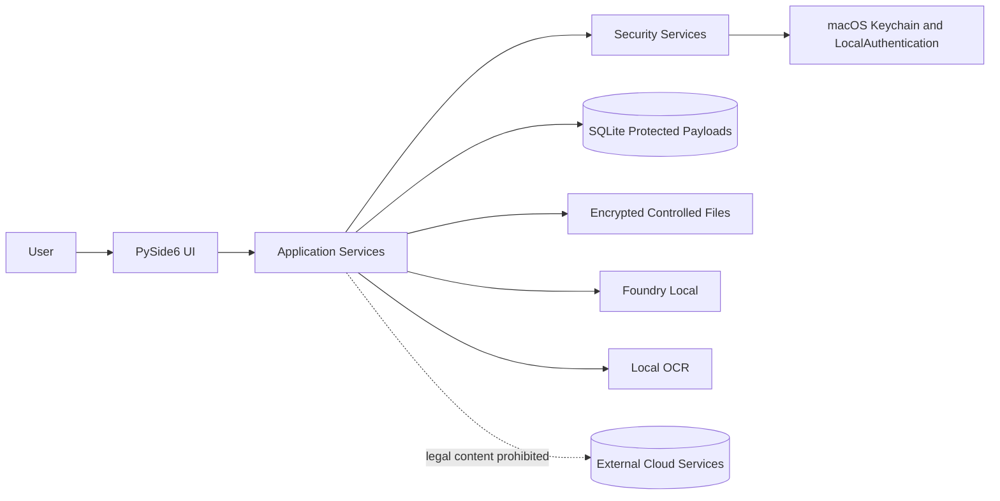
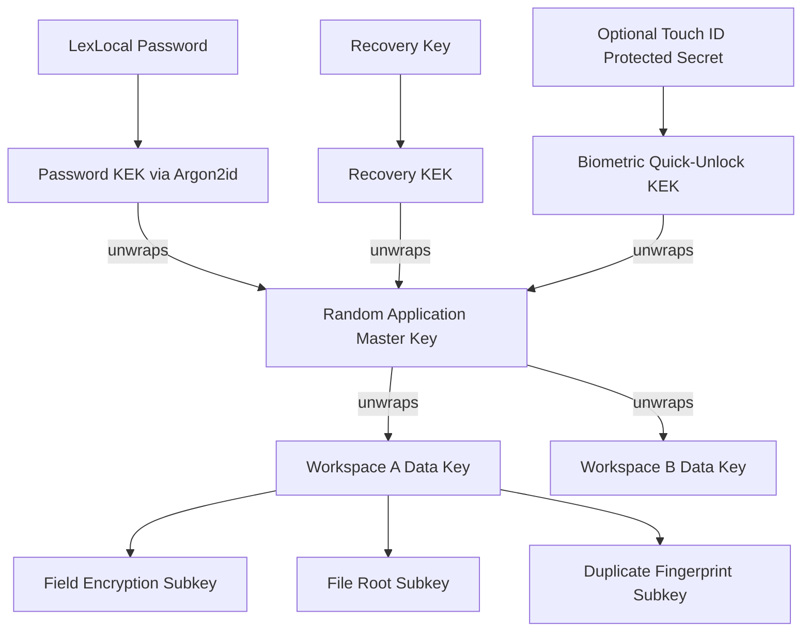

# LexLocal — Security Design

**Document ID:** `06_SECURITY_DESIGN.md`  
**Project:** LexLocal — On-Device Legal Document Intelligence Workspace  
**Status:** Approved first-release security baseline  
**Primary platform:** macOS on Apple Silicon  
**User model:** Single operating-system user, single LexLocal security profile  
**Depends on:** `01_PROJECT_CHARTER.md`, `02_SCOPE_AND_MVP.md`, `03_USER_FLOWS_AND_STATES.md`, `04_SYSTEM_ARCHITECTURE.md`, `05_DATA_MODEL.md`  
**Security model:** Application-layer authenticated encryption, LexLocal master password, mandatory recovery key, workspace-specific keys, automatic locking, and optional Touch ID quick unlock

---

## 1. Purpose

This document defines how LexLocal protects legal documents and all data derived from them.

It specifies:

- the threat model,
- security objectives and non-goals,
- cryptographic primitives,
- master-password behavior,
- recovery-key behavior,
- key hierarchy,
- optional Touch ID integration,
- encryption of SQLite fields and controlled files,
- session locking,
- secure temporary-file handling,
- logging and diagnostics rules,
- deletion and cryptographic erasure,
- startup and recovery behavior,
- release controls,
- implementation order,
- and mandatory security tests.

This document is authoritative for security implementation.

The following documents remain authoritative for their own areas:

- `02_SCOPE_AND_MVP.md`: product and first-release scope,
- `03_USER_FLOWS_AND_STATES.md`: user-visible behavior and states,
- `04_SYSTEM_ARCHITECTURE.md`: component boundaries,
- `05_DATA_MODEL.md`: persistence structure.

A security implementation must not silently weaken this design. A necessary deviation requires an explicit Architecture Decision Record and a corresponding documentation update.

---

## 2. Approved Security Decisions

| Area | Decision |
|---|---|
| Security profile | LexLocal has its own password, independent from the macOS login password |
| Password minimum | 12 Unicode characters; long passphrases are encouraged |
| Password composition | No forced uppercase, digit, or symbol mixture |
| Password KDF | Argon2id with a random salt and calibrated parameters |
| Content encryption | AES-256-GCM authenticated encryption |
| Subkey derivation | HKDF-SHA-256 with explicit purpose labels |
| Randomness | Operating-system cryptographically secure random source |
| Master key | Random 256-bit application master key |
| Workspace key | Independent random 256-bit data key per workspace |
| Password change | Re-wrap the master key; do not re-encrypt every document |
| Recovery key | Mandatory high-entropy random recovery key |
| Recovery-key export | No automatic plaintext `.txt` export |
| Recovery confirmation | User confirms selected recovery-key groups |
| Recovery result | New password, invalidated old recovery key, and newly issued recovery key |
| Password and recovery key both lost | No backdoor; explicit destructive LexLocal reset only |
| Touch ID | Optional Keychain-based quick unlock; not a first-release blocker |
| Touch ID fallback | LexLocal password, not the macOS password |
| Database | Standard SQLite through Python `sqlite3`; sensitive fields encrypted before persistence |
| Source documents | Stored as encrypted controlled local files |
| Derived data | OCR text, chunks, embeddings, chats, analyses, and evidence encrypted at rest |
| Session lock | Locks on macOS lock/sleep and inactivity; default 15 minutes |
| Wrong attempts | Progressive delay; no automatic wipe and no permanent lockout |
| Background jobs during lock | Existing jobs may finish safely; new protected operations do not start |
| Logging | No document text, full questions, prompts, passwords, recovery keys, or keys |
| Workspace deletion | Delete content and destroy workspace-specific data key |
| Physical overwrite claims | None; SSD/APFS physical overwrite is not guaranteed |
| Cloud behavior | No cloud LLM, OCR, embedding, or legal-content telemetry fallback |
| Security claims | No absolute-security or automatic legal-compliance claim |

---

# PART I — SECURITY OBJECTIVES AND THREAT MODEL

## 3. Security Objectives

LexLocal must provide the following first-release properties.

### 3.1 Confidentiality at rest

A person who copies the LexLocal application-data directory while the application is locked must not be able to read:

- source documents,
- extracted text,
- OCR output,
- chunks,
- embeddings,
- chat content,
- analysis content,
- evidence excerpts,
- or sensitive workspace/document names

without a valid unlock path.

### 3.2 Integrity

LexLocal must detect unauthorized modification of:

- encrypted database values,
- encrypted source files,
- wrapped keys,
- file-encryption headers,
- and other authenticated security envelopes.

Modified ciphertext must never be returned as partial plaintext.

### 3.3 Workspace separation

A workspace key, lookup fingerprint, query, or repository operation must not expose another workspace's content.

### 3.4 Local processing

Normal document processing, retrieval, inference, and analysis must occur locally.

### 3.5 Recoverability without a backdoor

A valid recovery key may restore access after password loss. No hidden administrator or vendor recovery path exists.

### 3.6 Safe failure

A failed decryption, corrupted database, interrupted deletion, or missing key must not be treated as success.

### 3.7 Least plaintext

Plaintext must exist only where required and for the shortest practical duration.

---

## 4. Protected Assets

High-value assets include:

- original PDF, JPEG, and PNG files,
- OCR and native extracted text,
- page-level text and geometry,
- chunks and embeddings,
- workspace and document names,
- user questions and AI answers,
- conversation summaries,
- retrieval queries,
- evidence excerpts,
- citations and source mappings,
- structured analyses and user edits,
- password-derived keys,
- recovery material,
- application master key,
- workspace data keys,
- and sensitive diagnostic information.

---

## 5. Threat Actors Considered

The first release is designed to reduce risk from:

1. A person copying LexLocal files while the application is locked.
2. A person gaining storage access without the LexLocal password.
3. Another non-administrator local macOS account.
4. Accidental leakage through logs, temporary files, crash data, or plaintext database fields.
5. A programming defect that attempts a cross-workspace query.
6. File or ciphertext modification.
7. An interrupted write, interrupted replacement, or interrupted deletion.
8. A user accidentally leaving a recovery key in an automatically generated plaintext file.
9. Historical citations being redirected to the wrong source.
10. A stale or wrong workspace key being used against ciphertext.

---

## 6. Threats Not Fully Solved

LexLocal does not claim full protection against:

- malware executing under the unlocked user's account,
- administrator or root compromise,
- kernel compromise,
- debugging or memory dumping of the running application,
- maliciously modified LexLocal binaries,
- screenshots, screen recording, cameras, or shoulder surfing,
- hardware attacks against an unlocked device,
- a user intentionally copying visible plaintext,
- plaintext source files that remain outside LexLocal,
- external backup systems retaining old encrypted data,
- APFS snapshots and SSD wear-leveling,
- vulnerabilities in macOS, Qt, Foundry Local, OCR, or cryptographic dependencies.

If the device is already compromised while LexLocal is unlocked, confidentiality cannot be guaranteed.

---

## 7. Honest Security Language

Acceptable statement:

> LexLocal processes legal content locally and protects stored sensitive data with application-layer encryption.

Prohibited statements:

- “Unhackable”
- “Military-grade security”
- “Guaranteed KVKK compliance”
- “Completely unrecoverable SSD deletion”
- “The operating system can never access the data”
- “Touch ID encrypts the documents”

Touch ID is an unlock mechanism, not the encryption algorithm.

---

# PART II — SECURITY ARCHITECTURE

## 8. Security Boundary Diagram



Rules:

- Presentation code does not implement cryptography.
- UI widgets do not receive raw key bytes.
- Repositories do not decide unlock policy.
- Foundry Local and OCR receive only the minimum plaintext required for the local operation.
- No cloud fallback is available.

---

## 9. Core Security Services

The implementation must include clear boundaries for:

- `PasswordKeyDeriver`
- `MasterKeyStore`
- `WorkspaceKeyManager`
- `FieldEncryptionProvider`
- `ControlledFileCipher`
- `SessionSecurityService`
- `RecoveryService`
- `BiometricQuickUnlock`
- `SecureTemporaryStorage`
- `SecureDiagnosticLogger`

These are created in the application composition root, not inside UI widgets.

---

# PART III — CRYPTOGRAPHIC PRIMITIVES

## 10. AES-256-GCM

AES-256-GCM is used for authenticated encryption.

Every encryption operation requires:

- a 256-bit key,
- a unique nonce for that key,
- authenticated associated data,
- and authentication-tag verification before use.

A failed authentication tag must:

- return no plaintext,
- stop the affected operation,
- create a sanitized integrity error,
- and route to safe recovery where appropriate.

The application must not implement AES or GCM manually.

---

## 11. Argon2id

Argon2id derives a password key-encryption key from the LexLocal password.

Stored metadata includes:

- random salt,
- memory cost,
- time cost,
- parallelism,
- algorithm/version identifier,
- and security-profile format version.

The password-derived key does not directly encrypt documents. It unwraps the random application master key.

---

## 12. HKDF-SHA-256

HKDF-SHA-256 derives independent purpose-specific subkeys.

Example labels:

```text
lexlocal/master/password-wrap/v1
lexlocal/master/recovery-wrap/v1
lexlocal/master/biometric-wrap/v1
lexlocal/workspace/key-wrap/v1
lexlocal/workspace/field-encryption/v1
lexlocal/workspace/file-root/v1
lexlocal/workspace/duplicate-fingerprint/v1
lexlocal/workspace/text-fingerprint/v1
lexlocal/workspace/analysis-source-set-fingerprint/v1
```

A derived key must not be reused for another purpose.

Derivation context should include, where applicable:

- application identifier,
- workspace ID,
- key version,
- purpose label,
- and format version.

---

## 13. Secure Randomness

Use approved cryptographic-library APIs backed by the operating system for:

- master keys,
- workspace keys,
- recovery keys,
- salts,
- nonces,
- file nonce prefixes,
- and quick-unlock secrets.

Do not use:

- Python `random`,
- timestamps,
- UUID values,
- predictable counters alone,
- or manually seeded pseudorandom values

for cryptographic secrets.

---

## 14. Cryptographic Dependency

The preferred Python implementation is the `cryptography` package with pinned versions.

The release environment must support:

- AES-GCM,
- Argon2id,
- HKDF,
- secure random generation,
- and the packaged macOS architecture.

Missing required cryptographic support is a release failure. The application must not silently fall back to a weaker algorithm.

---

## 15. Algorithm Agility

Every encrypted envelope includes:

- envelope version,
- algorithm identifier,
- key version,
- nonce,
- ciphertext,
- authentication tag.

Version 1:

```text
Encryption: AES-256-GCM
Password KDF: Argon2id
Subkey derivation: HKDF-SHA-256
```

Unknown versions are rejected, not guessed.

---

# PART IV — KEY HIERARCHY

## 16. Key Hierarchy



---

## 17. Application Master Key

During first setup:

1. Generate a random 256-bit application master key.
2. Derive the password KEK using Argon2id.
3. Wrap the master key with AES-256-GCM.
4. Generate the recovery key.
5. Derive an independent recovery KEK.
6. Wrap the same master key through the recovery path.
7. Persist only protected wrappers and metadata.
8. Remove temporary plaintext key references as soon as practical.

The master key is used to protect workspace keys. It is not used directly for every document field.

---

## 18. Workspace Data Keys

Each workspace receives an independent random 256-bit data key.

The workspace data key:

- is generated during workspace creation,
- is wrapped by a master-key-derived key,
- has a key version,
- is loaded only after unlock,
- and is destroyed during permanent workspace deletion.

This provides:

- independent workspace cryptographic boundaries,
- workspace-scoped duplicate fingerprints,
- targeted cryptographic erasure,
- and reduced impact if one workspace key is exposed.

---

## 19. Workspace Subkeys

The workspace data key derives independent subkeys for:

- database-field encryption,
- controlled-file encryption,
- duplicate fingerprints,
- normalized-text fingerprints,
- analysis source-set fingerprints,
- and any later protected metadata purpose.

The workspace key is not reused directly for all operations.

---

## 20. Key Material in Memory

LexLocal must:

- avoid global plaintext key variables,
- centralize unlocked key state in `SessionSecurityService`,
- expose narrow key leases instead of raw master-key access where practical,
- never include keys in string representations,
- never log keys,
- clear caches on lock,
- and release key references when operations finish.

Python cannot guarantee physical memory zeroization. The application therefore minimizes scope and lifetime but does not claim perfect memory erasure.

---

# PART V — MASTER PASSWORD

## 21. Password Policy

The LexLocal password:

- must contain at least 12 Unicode characters,
- may contain spaces,
- should support long passphrases,
- must accept at least 128 Unicode code points,
- is not forced to include uppercase, lowercase, digits, and symbols,
- and is checked against a bundled local list of extremely common passwords.

The UI should recommend 15 or more characters for a memorable passphrase, while the enforced minimum remains 12.

Password-strength feedback is advisory and does not replace policy checks.

---

## 22. Password Handling Rules

- Preserve the exact entered password.
- Do not trim spaces.
- Do not lowercase.
- Do not store plaintext.
- Do not send the password to a server.
- Do not include it in exception details.
- Do not preserve it in UI state after the operation completes.

UTF-8 encoding is used consistently for KDF input. Any Unicode normalization decision must be frozen before release and tested for compatibility. The safer first-release behavior is not to apply hidden normalization.

---

## 23. Argon2id Calibration

Reference policy:

- minimum memory cost: 64 MiB,
- preferred range: 64–256 MiB,
- target latency: approximately 300–750 ms on the documented reference Mac,
- minimum time cost: 2,
- conservative parallelism,
- salt length of at least 128 bits.

Exact parameters are benchmarked on the target development Mac and stored with the security profile.

Tests use an explicit test configuration. Production settings must never be silently reduced for test speed.

---

## 24. Password Verification

LexLocal verifies a password by:

1. deriving the password KEK,
2. attempting authenticated unwrap of the master key,
3. validating expected envelope context.

No reversible password and no plaintext-equivalent password verifier is stored.

The unlock UI reports a generic incorrect-password result rather than detailed cryptographic information.

---

## 25. Progressive Delay

| Failed attempts | Delay |
|---:|---:|
| 1–3 | No intentional delay beyond KDF execution |
| 4 | 30 seconds |
| 5 | 60 seconds |
| 6 | 2 minutes |
| 7 | 4 minutes |
| 8 | 8 minutes |
| 9+ | Exponential increase, capped at 60 minutes |

Rules:

- delay state persists across restart,
- successful unlock resets the counter,
- successful recovery resets the counter,
- no automatic wipe,
- no permanent lockout,
- no administrator bypass.

Argon2id and password strength remain the main protection against offline guessing.

---

## 26. Password Change

Password change requires the current LexLocal password.

Flow:

1. Authenticate current password.
2. Validate new password and confirmation.
3. Generate a new random Argon2id salt.
4. Derive the new password KEK.
5. Re-wrap the existing master key.
6. Atomically update the security profile.
7. Invalidate the old password wrapper.
8. Keep the existing recovery key.
9. Clear temporary key material.

Changing the password must not re-encrypt all documents, chunks, embeddings, chats, or analyses.

If the update fails, the old password remains valid.

---

# PART VI — RECOVERY KEY

## 27. Recovery-Key Properties

The recovery key is:

- generated by LexLocal,
- random,
- at least 256 bits of entropy,
- encoded in a transcription-friendly grouped format,
- not user-selected,
- and independent from the password.

Illustrative display only:

```text
ABCD-EFGH-JKLM-NPQR-STUV-WXYZ-2345-6789
```

The final number of groups depends on the chosen encoding.

---

## 28. Recovery-Key Setup

During first setup:

1. Generate the key.
2. Display it once.
3. Explain the consequence of losing both credentials.
4. Allow explicit copy.
5. Allow explicit print if the print path is safely implemented.
6. Do not automatically save a plaintext file.
7. Ask the user to enter selected random groups.
8. Create the recovery master-key wrapper.
9. Complete setup only after successful confirmation.

The UI should recommend:

- a reputable password manager,
- a physically protected printed copy,
- or another user-controlled offline location.

---

## 29. Clipboard Rules

When the user explicitly copies the recovery key:

- warn that other applications may read the clipboard,
- schedule best-effort clearing after a short interval,
- clear only if the clipboard still contains the exact LexLocal value,
- never log the value.

Clipboard clearing cannot revoke data already read by another application.

---

## 30. Recovery-Key Storage

LexLocal stores:

- a recovery-derived master-key wrapper,
- derivation metadata,
- a non-reversible verification mechanism,
- and recovery-key version.

LexLocal never stores:

- plaintext recovery key,
- displayed recovery text,
- an automatic `.txt` copy,
- or recovery-key content in logs.

---

## 31. Password Recovery

Flow:

1. User selects **Recovery Key Kullan**.
2. Repeated invalid attempts are rate-limited.
3. User enters the full recovery key.
4. LexLocal derives the recovery KEK.
5. The master-key wrapper is authenticated and opened.
6. User chooses a new LexLocal password.
7. A new password wrapper is created.
8. The old recovery key is invalidated.
9. A new recovery key is generated.
10. The user saves and confirms the new key.
11. The update commits atomically.

The old recovery key must fail after recovery succeeds.

Recovery key cannot repair:

- a corrupt database,
- missing encrypted source files,
- destroyed workspace keys,
- or missing security-profile metadata.

---

## 32. Recovery-Key Rotation

The **Recovery Key’i Yenile** action requires the current LexLocal password.

It:

- generates a new key,
- creates a new recovery wrapper,
- requires confirmation,
- invalidates the old key only after successful commit.

If the user cancels confirmation, the old key remains valid.

---

## 33. Password and Recovery Key Both Lost

There is no backdoor.

The user may choose **LexLocal’ı Sıfırla**.

The UI must state:

> LexLocal parolanız ve recovery key’iniz olmadan mevcut veriler kurtarılamaz. Sıfırlama; tüm workspace’leri, belgeleri, sohbetleri, analizleri ve şifreleme anahtarlarını kalıcı olarak silecektir.

Required confirmation:

1. Type `LEXLOCAL'I SIFIRLA`.
2. Confirm the final destructive action.
3. Delete the existing application data and key material.
4. Return to first-run setup.

The reset creates a new security profile and does not recover old content.

---

# PART VII — OPTIONAL TOUCH ID

## 34. Scope and Priority

Touch ID is optional quick unlock.

Mandatory first-release security is:

- password,
- recovery key,
- encryption,
- workspace keys,
- automatic lock,
- safe deletion.

Touch ID is implemented only after those features are complete. Its absence must not prevent secure password-based use.

---

## 35. Touch ID Design

After password unlock, the user may enable Touch ID.

The intended design:

1. Create a random quick-unlock secret.
2. Store it in macOS Keychain.
3. Protect access through LocalAuthentication.
4. Use it to open a dedicated master-key quick-unlock wrapper.
5. Never receive or store fingerprint data.

Prefer a policy bound to the current biometric set so biometric enrollment changes invalidate the existing item.

---

## 36. Touch ID Fallback

If Touch ID:

- is unavailable,
- is cancelled,
- fails,
- becomes locked,
- has no enrolled fingerprint,
- or its Keychain item is invalidated,

LexLocal requests the **LexLocal password**.

The macOS account password does not replace the LexLocal password.

---

## 37. Touch ID Restrictions

Touch ID alone must not authorize:

- password change,
- recovery-key rotation,
- workspace permanent deletion,
- LexLocal reset,
- or security-profile export.

Those operations require the LexLocal password.

---

## 38. Platform Interface

```python
class BiometricQuickUnlock:
    def is_available(self) -> bool: ...
    def enable(self, session: "UnlockedSession") -> None: ...
    def try_unlock(self) -> "UnlockResult": ...
    def disable(self) -> None: ...
```

PyObjC and Apple framework details remain inside the macOS infrastructure adapter.

A password-only implementation supports unsupported platforms.

---

# PART VIII — DATABASE FIELD ENCRYPTION

## 39. Application-Layer Encryption

LexLocal uses standard SQLite through Python `sqlite3`.

Sensitive values are encrypted before they reach SQLite.

LexLocal does not claim whole-database SQLCipher encryption.

Visible metadata may include:

- opaque IDs,
- state values,
- timestamps,
- page numbers,
- vector dimensions,
- model IDs,
- and generic error codes.

Legal content and identifying names remain protected.

---

## 40. Encrypted Field Envelope

A version-1 field envelope contains:

```text
magic identifier
format version
algorithm identifier
workspace key version
nonce
ciphertext
authentication tag
```

Associated data binds ciphertext to:

- application ID,
- table name,
- column name,
- workspace ID,
- row ID,
- key version,
- envelope version.

Copying an encrypted field to a different row, column, or workspace must fail authentication.

---

## 41. Fields That Must Be Encrypted

At minimum:

- workspace names,
- document names and filenames,
- retained source hashes,
- processing warnings that reveal content,
- extracted page text,
- OCR text,
- source geometry where sensitive,
- chunk text,
- embedding vectors,
- chat titles,
- questions,
- answers,
- conversation summaries,
- retrieval queries,
- evidence excerpts,
- analysis sections,
- user analysis drafts,
- stale-analysis explanations,
- activity metadata containing document or matter names.

---

## 42. Embedding Encryption

Embeddings are sensitive derived data.

Before encryption:

1. Validate dimensions.
2. Reject NaN and infinity.
3. Reject zero vectors.
4. Normalize to unit length.
5. Serialize as fixed-endian `float32`.
6. Bind chunk ID, workspace ID, model ID, dimension, and format version in associated data.

During retrieval:

- decrypt only eligible vectors in the active workspace and scope,
- keep arrays only for the retrieval operation or bounded cache,
- clear caches on lock, deletion, version activation, or model change,
- never log vector values.

---

## 43. SQLite WAL and Temporary Structures

Because sensitive fields are encrypted before persistence:

- the database contains ciphertext for protected values,
- WAL records contain ciphertext for those values,
- plaintext full-text-search tables are prohibited,
- raw legal text must not be used as temporary SQL values unless unavoidable.

Operational schema metadata remains visible to someone who copies the SQLite file.

---

# PART IX — CONTROLLED FILE ENCRYPTION

## 44. Source File Requirements

Imported PDF, JPEG, and PNG files are copied into LexLocal-controlled encrypted storage.

The encrypted format must support:

- large files,
- streaming,
- integrity checking,
- cancellation,
- atomic activation,
- format versioning,
- and corruption detection.

---

## 45. Chunked File Encryption

For each controlled file:

1. Derive a unique file key from the workspace file-root key and file ID.
2. Generate a new cryptographically random 8-byte nonce prefix for this
   encryption operation.
3. Divide plaintext into fixed-size chunks.
4. Encrypt each chunk independently with AES-256-GCM.
5. Construct a unique nonce from prefix and chunk index.
6. Bind file ID, workspace ID, chunk index, format version, and protected metadata in associated data.
7. Write an authenticated header.
8. Validate final structure.
9. Atomically activate the encrypted file.

Version-1 nonce construction is exact:

```python
nonce = nonce_prefix_8_bytes + chunk_index.to_bytes(4, "big")
```

AES-GCM nonce length is exactly 96 bits / 12 bytes. Data chunk indexes begin at
`0x00000000` and may extend through `0xFFFFFFFE`; `0xFFFFFFFF` is reserved for
the authenticated file-header envelope.

Counter wraparound is prohibited and overflow fails closed. Every file derives
a separate file key and every encryption operation generates a new random
prefix. A file-key/nonce pair is never reused. Retry starts a new staging file
and uses a new file-key context or, at minimum, a new prefix; it never resumes
a partial nonce sequence.

Prefix, format version, and counter interpretation are authenticated by the
header. Chunk index, workspace ID, file ID, key version, format version, and
required metadata are bound into AAD. Header and data nonces cannot collide.
Unknown nonce/file-format versions are rejected.

---

## 46. File Header

The authenticated header should include:

- magic bytes,
- format version,
- algorithm ID,
- workspace key version,
- file ID,
- chunk size,
- nonce prefix length,
- nonce prefix,
- original plaintext size,
- chunk count,
- and authentication information.

A modified header must prevent normal decryption.

---

## 47. Atomic File Write

```text
create staging file
→ encrypt chunks
→ authenticate final structure
→ flush and fsync where practical
→ atomic rename
→ mark stored blob ACTIVE
```

A failed staging file is never exposed as an active source.

---

## 48. Opening Source Documents

Prefer:

- in-memory decrypted byte streams,
- a random-access encrypted reader,
- or a controlled pipe.

If a dependency requires a plaintext path:

- use the LexLocal private temporary directory,
- apply restrictive permissions,
- generate an unpredictable name,
- track the artifact by job ID,
- delete it after use,
- clean it on failure/cancellation/startup,
- and never include client or document names in the filename.

Physical overwrite is not guaranteed.

---

## 49. Thumbnails and Previews

Thumbnails may reveal legal content.

They must be:

- generated in memory,
- or stored as encrypted derived artifacts.

They must not be left in an unprotected shared Qt or operating-system cache.

---

# PART X — DUPLICATE DETECTION

## 50. SHA-256

LexLocal computes SHA-256 over the exact imported source bytes.

The raw hash:

- is used for duplicate processing,
- may be retained only in encrypted form,
- and must not become a global plaintext document identifier.

---

## 51. Workspace-Scoped Fingerprint

Duplicate equality is enforced with:

```text
HMAC-SHA-256(
    workspace_duplicate_key,
    source_sha256
)
```

Properties:

- equal files in one workspace have equal fingerprints,
- equal files in different workspaces cannot be correlated from the database,
- a unique index prevents a live duplicate in the same workspace,
- the fingerprint does not reveal document content.

### 51.1 Workspace-Scoped Normalized-Text Fingerprint

When page or chunk idempotency and change detection require normalized-text
equality, LexLocal uses:

```text
HMAC-SHA-256(
    workspace_text_fingerprint_key,
    normalized_text
)
```

`workspace_text_fingerprint_key` is derived independently with the
`lexlocal/workspace/text-fingerprint/v1` HKDF purpose label. The result is
stored as a `BLOB` in `normalized_text_fingerprint`.

Properties:

- equal normalized text in one workspace has an equal fingerprint,
- equal normalized text in different workspaces cannot be correlated from the database,
- plaintext SHA-256 of normalized text is never persisted,
- the text-fingerprint key is not reused as the duplicate-file fingerprint key.

If normalized-text equality is not required by the implementation, the
fingerprint is omitted rather than replaced with an unkeyed digest.

### 51.2 Analysis Source-Set Fingerprint

Analysis source-set equality uses HMAC-SHA-256 with
`workspace_analysis_source_set_fingerprint_key` and the canonical bytes defined
by `05_DATA_MODEL.md`. The subkey uses purpose label
`lexlocal/workspace/analysis-source-set-fingerprint/v1` and is distinct from
the duplicate-file, normalized-text, and encryption keys.

The payload contains format version 1, profile, profile-schema version, and the
exact document/version/coverage entries. Sources and JSON keys are sorted,
encoded as compact UTF-8 JSON, and exclude null/UI fields and generation
metadata. The raw 32-byte HMAC is stored as `BLOB`.

Tests prove order independence, repeatability, sensitivity to profile, schema,
document-version and coverage changes, and different results under different
workspace keys.

---

# PART XI — SESSION LOCKING

## 52. Session States

```text
SETUP_REQUIRED
LOCKED
UNLOCKING
UNLOCKED
LOCKING
RECOVERY_MODE
RESETTING
```

Only `UNLOCKED` allows normal sensitive access.

---

## 53. Lock Triggers

LexLocal locks when:

- the macOS session locks,
- the device sleeps,
- configured inactivity expires,
- the user selects manual lock,
- a critical key-integrity failure occurs,
- or the application enters safe recovery mode.

Default inactivity: 15 minutes.

Options:

- 5 minutes,
- 15 minutes,
- 30 minutes,
- 60 minutes.

A one-minute warning offers **Oturumu Açık Tut**.

---

## 54. User Activity

Activity that resets the inactivity timer:

- keyboard interaction,
- mouse interaction,
- document scrolling,
- analysis editing,
- explicit LexLocal commands.

Background progress does not count as user activity.

---

## 55. Lock Operation

On lock:

1. Block new user commands.
2. Replace or obscure sensitive views.
3. Clear decrypted UI models.
4. Clear source-viewer buffers where practical.
5. Invalidate ordinary decryption context.
6. Clear retrieval caches.
7. Release normal session key references.
8. Preserve only approved job-scoped leases for already-running jobs.
9. Display unlock UI.

LexLocal does not claim complete physical removal of all past plaintext from RAM.

---

## 56. Background Jobs While Locked

Approved behavior:

- already-running OCR, indexing, or inference jobs may complete,
- new sensitive jobs do not start,
- results are encrypted before persistence,
- completed results are not displayed until unlock,
- jobs receive only the required workspace-scoped key lease,
- leases expire at completion or cancellation,
- a job waiting for user confirmation pauses until unlock.

---

## 57. Unlock Operation

1. Apply active delay.
2. Accept valid password, recovery, or Touch ID path.
3. Unwrap the master key.
4. Verify security-profile context.
5. Load workspace keys only as needed.
6. Perform required integrity checks.
7. Restore the normal UI.
8. Present safely completed background results.

Database or key-integrity failure enters recovery mode rather than partial unlock.

---

# PART XII — FILESYSTEM AND TEMPORARY DATA

## 58. Application Data Permissions

On macOS:

- application-data directory should be owner-only,
- controlled files should be owner read/write only,
- temporary storage should be owner-only,
- logs should be owner-only.

No controlled data is stored automatically in:

- source-code directory,
- Desktop,
- Downloads,
- or shared temporary directories.

Filesystem permissions are defense in depth, not a substitute for encryption.

---

## 59. Temporary-File Policy

- Avoid decrypted temp files.
- Use memory when practical.
- Use a LexLocal-owned private temp root.
- Use unpredictable names.
- Avoid unsafe symbolic-link following.
- Apply restrictive permissions immediately.
- Track every temp artifact.
- Clean on success, failure, cancellation, lock where applicable, and startup.
- Never include client names or document titles in temp filenames.

---

# PART XIII — LOGGING AND DIAGNOSTICS

## 60. Prohibited Log Content

Never log:

- passwords,
- recovery keys,
- Touch ID quick-unlock secrets,
- master keys,
- workspace keys,
- derived keys,
- full document content,
- OCR text,
- chunks,
- embedding values,
- full user questions,
- full AI answers,
- conversation summaries,
- analysis content,
- evidence excerpts,
- raw prompts,
- Keychain secret values.

---

## 61. Allowed Diagnostic Content

Allowed examples:

- opaque correlation ID,
- opaque workspace ID,
- job ID,
- component name,
- operation type,
- state transition,
- generic error code,
- duration,
- model identifier,
- page number,
- counts,
- exception class,
- sanitized stack trace.

Exception formatting must be tested so object representations do not leak sensitive values.

---

## 62. User Activity vs Technical Diagnostics

### Activity timeline

Human-readable business events:

- document processed,
- analysis version created,
- workspace archived,
- job failed.

### Technical log

Developer/support information:

- safe error codes,
- component state,
- timings,
- package versions.

Do not share unrestricted payload dictionaries between these systems.

---

## 63. Diagnostic Export

A diagnostic report, when implemented:

- is explicitly user-triggered,
- previews included categories,
- excludes legal content and secrets,
- uses opaque identifiers,
- includes dependency/application versions,
- saves only to a user-selected destination.

Unsafe diagnostic export must be omitted rather than shipped.

---

# PART XIV — LOCAL AI AND NETWORK SECURITY

## 64. Network Policy

Allowed:

- explicit Foundry Local model/runtime setup,
- developer dependency installation,
- a future explicit update check if separately approved.

Prohibited:

- cloud LLM fallback,
- remote OCR,
- remote embedding,
- silent legal-content telemetry,
- automatic diagnostic upload,
- cloud document sync in the first release.

---

## 65. Foundry Local Adapter

The adapter must:

- target the local runtime only,
- reject unexpected remote endpoint configuration,
- avoid logging prompts,
- enforce timeout and cancellation,
- receive only minimum required plaintext,
- clear prompt/result references after persistence,
- return structured evidence codes for citation validation.

LexLocal does not claim complete immediate zeroization of model-runtime memory.

---

## 66. OCR Adapter

The OCR adapter:

- runs locally,
- receives only required page images,
- avoids plaintext debug output,
- does not leave debug images in shared storage,
- and removes temporary artifacts on all exit paths.

---

# PART XV — DELETION AND RESET

## 67. Document Deletion

Document deletion must remove:

- encrypted source file,
- page and OCR text,
- chunks,
- embeddings,
- source geometry,
- source excerpts,
- duplicate fingerprints,
- caches,
- temporary artifacts.

It may retain only approved minimal tombstones and historical citation metadata.

Historical citations show:

> Kaynak belge silindiği için artık görüntülenemiyor.

They must never redirect to another document or version.

---

## 68. Workspace Deletion

Workspace deletion:

1. Blocks new operations.
2. Deletes controlled source and derived files.
3. Removes workspace-owned sensitive database records.
4. Destroys the workspace data key.
5. Clears in-memory workspace key material.
6. Invalidates caches.
7. Completes only after verified cleanup.

Destroying the workspace data key provides cryptographic erasure for remaining ciphertext, subject to backup, snapshot, SSD, and threat-model limitations.

---

## 69. Deletion Failure

If deletion fails:

- do not report success,
- do not reopen the workspace normally,
- set `DELETION_RECOVERY`,
- persist a sanitized deletion task,
- allow safe retry,
- do not expose unnecessary raw paths.

---

## 70. LexLocal Reset

Reset removes:

- security profile,
- password/recovery wrappers,
- master-key access,
- workspace-key records,
- database,
- controlled files,
- temporary data,
- Keychain quick-unlock item,
- and normal application metadata.

After reset, first-run setup begins with entirely new keys.

---

# PART XVI — INTEGRITY AND RECOVERY

## 71. Startup Security Checks

Before normal use:

- verify migration checksums,
- verify expected security-profile version,
- validate wrapper metadata,
- detect incomplete deletions,
- detect stale processing jobs,
- perform configured SQLite integrity checks,
- detect missing source/database relationships.

A full expensive database integrity check may be periodic or user-triggered.

---

## 72. Ciphertext Authentication Failure

If AES-GCM authentication fails:

- return no plaintext,
- block the affected operation,
- generate a sanitized integrity error,
- mark the record unavailable,
- enter workspace or application recovery mode if required.

Repeated failures may indicate wrong key, corruption, or tampering.

---

## 73. Partial Restore

If the database exists without matching controlled files, or files exist without matching database rows:

- do not invent content,
- do not redirect citations,
- mark sources unavailable,
- show recovery state,
- preserve safe mismatch metadata,
- do not expose legal text in diagnostics.

---

# PART XVII — DEPENDENCIES AND RELEASE CONTROLS

## 74. Dependency Controls

Security-relevant dependencies must be:

- pinned,
- installed from official package sources,
- locked with hashes where practical,
- reviewed for licenses,
- tested in the packaged `.app`.

High-value dependencies:

- PySide6/Qt,
- `cryptography`,
- Foundry Local runtime/SDK,
- Tesseract,
- NumPy,
- PDF components,
- PyObjC if Touch ID is included.

---

## 75. Release Checks

Before release:

- debug mode disabled,
- test keys absent,
- test KDF profile absent,
- plaintext development encryption disabled,
- safe log level enabled,
- no real or sensitive fixture accidentally packaged,
- local Foundry configuration verified,
- application-data permissions verified,
- encryption format version fixed,
- migrations checksummed,
- `.app` and `.dmg` tested,
- Touch ID safely disabled if not completed.

---

## 76. Development-Only Encryption Provider

A plaintext provider may exist only during the earliest skeleton stage if all conditions hold:

- class name clearly contains `InsecureDevelopmentOnly`,
- production composition refuses to start with it,
- it is excluded from release builds,
- automated tests enforce the real provider in release configuration,
- no real legal document is processed through it.

It must not survive into external demos.

---

# PART XVIII — INTERFACES

## 77. Required Security Contracts

```python
class PasswordKeyDeriver:
    def derive(self, password: str, params: "Argon2Parameters") -> bytes:
        ...

class MasterKeyStore:
    def initialize(self, password: str) -> "RecoverySetup":
        ...

    def unlock_with_password(self, password: str) -> "UnlockedSession":
        ...

    def unlock_with_recovery(self, recovery_key: str) -> "UnlockedSession":
        ...

    def change_password(self, current_password: str, new_password: str) -> None:
        ...

class WorkspaceKeyManager:
    def create_workspace_key(self, workspace_id: str) -> None:
        ...

    def lease(self, workspace_id: str, purpose: str) -> "KeyLease":
        ...

    def destroy(self, workspace_id: str) -> None:
        ...

class FieldEncryptionProvider:
    def encrypt(
        self,
        workspace_id: str,
        row_id: str,
        field_context: str,
        plaintext: bytes,
    ) -> bytes:
        ...

    def decrypt(
        self,
        workspace_id: str,
        row_id: str,
        field_context: str,
        envelope: bytes,
    ) -> bytes:
        ...

class ControlledFileCipher:
    def encrypt_file(self, source, destination, context) -> "FileCipherResult":
        ...

    def open_reader(self, stored_blob, context) -> "EncryptedFileReader":
        ...

class SessionSecurityService:
    def lock(self, reason: str) -> None:
        ...

    def unlock(self, credential) -> "UnlockResult":
        ...

    def issue_job_lease(
        self,
        workspace_id: str,
        job_id: str,
        purpose: str,
    ) -> "JobKeyLease":
        ...

class RecoveryService:
    def rotate_recovery_key(self, password: str) -> "RecoverySetup":
        ...

    def reset_application(self, confirmation: str) -> None:
        ...
```

Presentation code must never receive master or workspace keys directly.

---

# PART XIX — IMPLEMENTATION ORDER

## 78. Mandatory Sequence

1. Security-domain value objects and error codes
2. Secure random generation
3. AES-GCM field-envelope codec
4. HKDF purpose-specific derivation
5. Argon2id calibration
6. Master-key initialization and password unlock
7. Workspace-key creation and wrapping
8. Encrypted SQLite field codec
9. Chunked controlled-file encryption
10. Recovery-key setup and rotation
11. Password change
12. Session lock and inactivity handling
13. Job-scoped key leases
14. Secure temp and logging
15. Document deletion
16. Workspace deletion and reset
17. Tamper and recovery handling
18. Optional Touch ID
19. Package-level security verification

Touch ID is deliberately implemented last.

---

# PART XX — SECURITY TESTS

## 79. Cryptographic Tests

Test:

- field encryption round trip,
- file encryption across multiple chunks,
- empty and boundary-sized content,
- wrong key failure,
- modified nonce failure,
- modified header failure,
- modified ciphertext/tag failure,
- cross-row ciphertext copy failure,
- cross-workspace decryption failure,
- nonce uniqueness,
- vector serialization,
- recovery wrapper invalid-key failure,
- unknown format-version rejection.

Where available, use trusted external test vectors in addition to self-generated round trips.

---

## 80. Password and Recovery Tests

Test:

- minimum length,
- spaces and Unicode,
- no trimming,
- common-password rejection,
- valid unlock,
- invalid unlock,
- delay persistence,
- successful counter reset,
- password change,
- old password invalidation,
- recovery unlock,
- old recovery key invalid after recovery,
- new recovery key valid,
- cancelled rotation preserves old key,
- reset destroys previous access.

---

## 81. Session Tests

Test:

- manual lock,
- inactivity lock,
- macOS sleep/session lock,
- one-minute warning,
- activity timer reset,
- sensitive UI hidden,
- vector cache cleared,
- no new protected job after lock,
- active job completes encrypted,
- unlock reveals completion,
- Touch ID failure uses LexLocal password fallback.

---

## 82. Plaintext Leakage Test

Use a unique marker:

```text
LEXLOCAL_SECRET_TEST_93841
```

Place it in:

- a document,
- OCR output,
- user question,
- answer,
- evidence excerpt,
- analysis section.

Scan:

- main SQLite database,
- WAL/journal files,
- controlled files,
- temporary directories,
- logs,
- diagnostic exports,
- release artifacts.

The marker must not appear in plaintext outside explicitly decrypted test output.

---

## 83. Deletion Tests

### Document deletion

Verify:

- source gone,
- pages/chunks/embeddings gone,
- excerpts cleared,
- duplicate fingerprint cleared,
- old citation shows source deleted,
- unrelated documents remain available.

### Workspace deletion

Verify:

- workspace key destroyed,
- workspace-sensitive rows removed,
- workspace controlled directory removed,
- caches cleared,
- copied old ciphertext cannot be opened through remaining workspace keys,
- other workspaces remain available.

### Application reset

Verify:

- old password fails,
- old recovery key fails,
- old Touch ID item fails,
- old ciphertext cannot be accessed,
- first-run setup starts cleanly.

---

## 84. Tamper and Recovery Tests

Test:

- modified database ciphertext,
- modified encrypted file chunk,
- missing source file,
- missing database row,
- migration checksum mismatch,
- wrong workspace in associated data,
- stale job key lease,
- interrupted password change,
- interrupted recovery rotation,
- interrupted workspace deletion.

Every case must fail safely without false success.

Controlled-file nonce tests additionally prove:

- separate encryption runs use different prefixes,
- every chunk nonce is unique,
- counter encoding is unsigned big-endian,
- boundary chunk indexes behave correctly,
- overflow is rejected,
- header and data nonces are disjoint,
- modified prefix/header/counter data fails authentication,
- interrupted retry does not reuse a nonce sequence.

---

## 85. Touch ID Tests

When Touch ID is implemented:

- unavailable hardware,
- no enrolled fingerprint,
- successful unlock,
- cancelled prompt,
- failed biometric,
- changed biometric set,
- deleted Keychain item,
- disable/re-enable,
- packaged `.app` behavior,
- password fallback,
- no macOS-password substitution.

---

# PART XXI — SECURITY ACCEPTANCE GATES

## 86. Security Gate SG-1 — Encryption Baseline

Pass only when:

- password opens a random master key,
- every workspace has a separate data key,
- sensitive SQLite fields are ciphertext,
- source documents are encrypted controlled files,
- tampering fails closed,
- release configuration cannot use plaintext provider.

---

## 87. Security Gate SG-2 — Recovery and Lock

Pass only when:

- recovery setup works,
- recovery confirmation works,
- recovery rotates the key,
- password change does not re-encrypt all content,
- manual and automatic lock work,
- progressive delay works,
- lost credentials allow destructive reset only,
- background-job lock behavior matches approved flows.

---

## 88. Security Gate SG-3 — Deletion and Plaintext Leakage

Pass only when:

- document deletion clears all required derived data,
- workspace-key destruction works,
- plaintext leakage scan passes,
- logs remain sanitized,
- interrupted deletion enters safe recovery.

---

## 89. Security Gate SG-4 — Optional Touch ID and Packaged Application

Touch ID may be declared complete only when:

- Keychain secret access is biometric-gated,
- biometric-set changes invalidate quick unlock,
- password fallback works,
- packaged `.app` passes tests.

Touch ID is optional. A safe disabled adapter is preferable to an incomplete insecure implementation.

---

# PART XXII — FINAL SECURITY CONTRACT

## 90. Final Contract

LexLocal has an independent master password and no hidden recovery backdoor.

The password derives an Argon2id key-encryption key that opens a random application master key. A mandatory random recovery key provides a second protected unlock path. Successful password recovery invalidates the old recovery key and issues a new one. Losing both credentials makes existing data unrecoverable; the only supported option is an explicit destructive LexLocal reset.

Every workspace has an independent random data key. HKDF-derived purpose-specific subkeys protect database fields, controlled source files, embeddings, and duplicate fingerprints. AES-256-GCM authenticates every encrypted payload with contextual associated data.

LexLocal continues to use the required standard SQLite `sqlite3` persistence layer. Sensitive values are encrypted before persistence, including legal text, OCR output, chunks, embeddings, chats, analyses, and evidence excerpts. LexLocal does not falsely claim whole-database encryption.

The application locks when macOS locks or sleeps and after configurable inactivity. Existing jobs may complete through narrow job-scoped key leases, while new protected operations remain blocked and completed results remain encrypted until unlock.

Touch ID is an optional Keychain-based quick-unlock adapter. It never replaces the LexLocal password and recovery model, and it is not allowed to delay the mandatory security baseline.

Document deletion removes source-derived data while retaining only approved tombstones. Workspace deletion additionally destroys the workspace data key, providing cryptographic erasure for remaining ciphertext within the stated threat-model limits.

Logs, diagnostics, temporary files, prompts, and error handling follow least-plaintext rules. Cloud AI fallback and legal-content telemetry are prohibited.

The first release is considered secure enough for its declared scope only when the encryption, recovery, locking, deletion, leakage, integrity, and packaging tests in this document pass.
